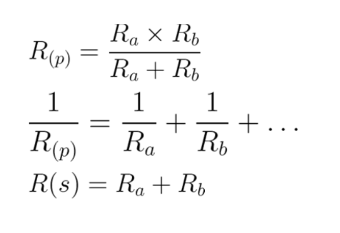

{width="3.0271817585301837in"
height="1.2133234908136483in"}

**CIRCUITOS DIGITAIS 2019.1**

**PRÁTICA 01 - INTRODUÇÃO AOS CIRCUITOS DIGITAIS**

**OBJETIVOS**

Estabelecer um primeiro contato com os equipamentos do laboratório;

Medir experimentalmente as grandezas elétricas, resistividade, tensão e
corrente;

**PARTE 1 - USO DO MULTÍMETRO**

Multímetro é um equipamento que permite a medição de diversas grandezas
elétricas, como tensão e corrente (contínua e alternada), resistência
elétrica, capacitância e continuidade de circuitos. É possível alternar
entre grandezas a serem medidas utilizando sua CHAVE SELETORA.

A seguir é mostrada a ilustração de um manual de multímetro. O
procedimento para realização das leituras pode ser estendido a qualquer
marca:

{width="3.264681758530184in"
height="4.302083333333333in"}{width="3.2750984251968505in"
height="4.65625in"}

**PARTE 2 - USO DO PROTOBOARD**

Protoboard, também conhecida como Matriz de Contatos, nada mais é que
uma placa com contatos metálicos interligados, de acordo com um padrão
que o usuário deve conhecer. Uma Protoboard pode ser dividida em quatro
partes: ➢ A primeira são as duas linhas (+ e -) da parte inferior da
Ilustração 1, as quais possuem seus orifícios interligados, ou seja,
todos os orifícios da linha + são interligados entre si e todos os
orifícios da linha – são interligados entre si; ➢ A segunda são as duas
linhas (+ e -) da parte superior da Ilustração 1, as quais possuem seus
orifícios interligados, ou seja, todos os orifícios da linha + são
interligados entre si e todos os orifícios da linha – são interligados
entre si; ➢ A terceira são as colunas A, B, C, D e E, as quais possuem
suas linhas numeradas.

{width="6.144890638670166in"
height="2.12950678040245in"}

Uma Protoboard pode ser dividida em TRES partes:

➢ As duas linhas (+ e -) da parte inferior e superior possuem seus
orifícios interligados, ou seja, todos os orifícios da linha + são
interligados entre si e todos os orifícios da linha – são interligados
entre si;

➢ As colunas A, B, C, D e E possuem interligações são entre as colunas
de uma mesma linha, ou seja, a coluna 1A, 1B, 1C, 1D e 1E possuem os
orifícios interligados, assim como a coluna 2A, 2B, 2C, 2D e 2E possuem
seus orifícios interligados, porém não há interligação entre os
orifícios das linhas 1 e 2 e assim por diante;

➢ As colunas F, G, H, I e J possuem interligações entre as colunas de
uma mesma linha, ou seja, a coluna 1F, 1G, 1H, 1I e 1J possuem os
orifícios interligados, assim como a coluna 2F, 2G, 2H, 2I e 2J possuem
seus orifícios interligados, porém não há interligação entre os
orifícios das linhas 1 e 2 e assim por diante. Vale ressaltar que a
coluna 1ABCDE **não** se conecta com a coluna 1FGHIJ e vice versa.

O padrão das interligações de contatos metálicos que o usuário deve
conhecer pode ser assim demonstrado:

{width="6.326351706036745in"
height="2.094037620297463in"}

**PARTE 3 - MONTAGEM DE CIRCUITOS**

Serão entregues 4 resistores, os quais serão indicados por R1, R2, R3 e
R4.

Com os resistores em mãos, monte no protoboard, o circuito, como segue
abaixo:

{width="3.6032239720034998in"
height="1.7961351706036746in"}

Utilizando a tabela de códigos de cores, determine o valor de
resistividade em Ohms de cada resistor:

▪ R1 = \_\_\_\_\_\_\_ Ω

▪ R2 = \_\_\_\_\_\_\_ Ω

▪ R3 = \_\_\_\_\_\_\_ Ω

▪ R4 = \_\_\_\_\_\_\_ Ω

Utilizando as fórmulas de cálculo de resistores, calcule qual a
resistividade entre os

pontos indicados no
circuito:nos{width="3.3844739720034998in"
height="2.3247714348206476in"}

▪ R(A – H) = \_\_\_\_\_\_\_

▪ R(B – C) = \_\_\_\_\_\_\_

▪ R(C – D) = \_\_\_\_\_\_\_

▪ R(B – D) = \_\_\_\_\_\_\_

▪ R(E – F) = \_\_\_\_\_\_\_

▪ R(F – G) = \_\_\_\_\_\_\_

▪ R(E – G) = \_\_\_\_\_\_\_

As resistências nos pontos (B – C), (C – D), (E – F) e (F – G) tem o
mesmo valor da resistência de R1, R2, R3 e R4, respectivamente? Por que
isso acontece?

  --
  --

Utilizando o multímetro, realize a medição da resistência elétrica nos
seguintes pontos:

▪ R(A – H) = \_\_\_\_\_\_\_

▪ R(B – C) = \_\_\_\_\_\_\_

▪ R(C – D) = \_\_\_\_\_\_\_

▪ R(B – D) = \_\_\_\_\_\_\_

▪ R(E – F) = \_\_\_\_\_\_\_

▪ R(F – G) = \_\_\_\_\_\_\_

▪ R(E – G) = \_\_\_\_\_\_

Conecte a fonte de alimentação aos pontos A (positivo) e H (negativo) do
circuito apresentado na figura 1. Ajuste-a para suprir 5 volts. Utilize
a primeira lei de Ohm (V = R x I) para calcular a diferença de potencial
elétrico (tensão) entre os pontos indicados:

▪ V(A – H) = \_\_\_\_\_\_\_

▪ V(B – C) = \_\_\_\_\_\_\_

▪ V(C – D) = \_\_\_\_\_\_\_

▪ V(B – D) = \_\_\_\_\_\_\_

▪ V(E – F) = \_\_\_\_\_\_\_

▪ V(F – G) = \_\_\_\_\_\_\_

▪ V(E – G) = \_\_\_\_\_\_

Anexo: Tabela de cores de resistor

{width="5.279411636045494in"
height="4.875287620297462in"}
