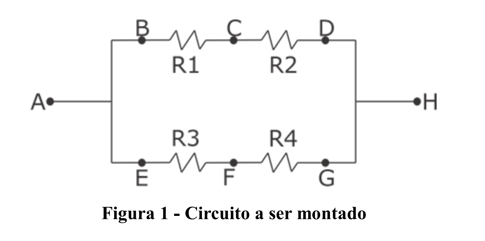

  

   
 
# PRÁTICA 01 - INTRODUÇÃO AOS CIRCUITOS DIGITAIS

[Voltar à home](../)
[Próxima Aula](./pr02.md)

## OBJETIVOS
- Estabelecer um primeiro contato com os equipamentos do laboratório;
- Medir experimentalmente as grandezas elétricas, resistividade, tensão e corrente;

## PARTE 1 - USO DO MULTÍMETRO
Multímetro é um equipamento que permite a medição de diversas grandezas elétricas, como tensão e corrente (contínua e alternada), resistência elétrica, capacitância e continuidade de circuitos. É possível alternar entre grandezas a serem medidas utilizando sua CHAVE SELETORA.
A seguir é mostrada a ilustração de um manual de multímetro. O procedimento para realização das leituras pode ser estendido a qualquer marca:

## PARTE 2 - USO DO PROTOBOARD
Protoboard, também conhecida como Matriz de Contatos, nada mais é que uma placa com contatos metálicos interligados, de acordo com um padrão
que o usuário deve conhecer. Observe a figura a seguir:

Uma Protoboard pode ser dividida em TRES partes:
- As duas linhas ($+$ e $-$) da parte inferior e superior possuem seus orifícios interligados, ou seja, todos os orifícios da linha + são interligados entre si e todos os orifícios da linha – são interligados entre si;
- As colunas A, B, C, D e E possuem interligações são entre as colunas de uma mesma linha, ou seja, a coluna 1A, 1B, 1C, 1D e 1E possuem os orifícios interligados, assim como a coluna 2A, 2B, 2C, 2D e 2E possuem seus orifícios interligados, porém não há interligação entre os orifícios das linhas 1 e 2 e assim por diante;
- As colunas F, G, H, I e J possuem interligações entre as colunas de uma mesma linha, ou seja, a coluna 1F, 1G, 1H, 1I e 1J possuem os orifícios interligados, assim como a coluna 2F, 2G, 2H, 2I e 2J possuem seus orifícios interligados, porém não há interligação entre os orifícios das linhas 1 e 2 e assim por diante. Vale ressaltar que a coluna 1-ABCDE **não** se conecta com a coluna 1-FGHIJ e vice versa.
O padrão das interligações de contatos metálicos que o usuário deve conhecer pode ser assim demonstrado:

## PARTE 3 - MONTAGEM DE CIRCUITOS
Serão entregues 4 resistores, os quais serão indicados por R1, R2, R3 e R4.
Com os resistores em mãos, monte no protoboard, o circuito, como segue abaixo:

Utilizando a tabela de códigos de cores, determine o valor de resistividade em Ohms de cada resistor:

- R1 = \_\_\_\_\_\_\_ Ω

- R2 = \_\_\_\_\_\_\_ Ω

- R3 = \_\_\_\_\_\_\_ Ω

- R4 = \_\_\_\_\_\_\_ Ω

Utilizando as fórmulas de cálculo de resistores, calcule qual a resistividade entre os pontos indicados no circuito:

Resistência em paralelo $R_p = \frac{R_a \times R_b}{R_a + R_b}$
Resistência em Série $R_s = R_a + R_b$

- R(A – H) = \_\_\_\_\_\_\_ Ω

- R(B – C) = \_\_\_\_\_\_\_ Ω

- R(C – D) = \_\_\_\_\_\_\_ Ω

- R(B – D) = \_\_\_\_\_\_\_ Ω

- R(E – F) = \_\_\_\_\_\_\_ Ω

- R(F – G) = \_\_\_\_\_\_\_ Ω

- R(E – G) = \_\_\_\_\_\_\_ Ω

As resistências nos pontos (B--C), (C--D), (E--F) e (F--G) tem o mesmo valor da resistência de R1, R2, R3 e R4, respectivamente? Por que isso acontece?

Utilizando o multímetro, realize a medição da resistência elétrica nos seguintes pontos:
- R(A – H) = \_\_\_\_\_\_\_ Ω
- R(B – C) = \_\_\_\_\_\_\_ Ω
- R(C – D) = \_\_\_\_\_\_\_ Ω
- R(B – D) = \_\_\_\_\_\_\_ Ω
- R(E – F) = \_\_\_\_\_\_\_ Ω
- R(F – G) = \_\_\_\_\_\_\_ Ω
- R(E – G) = \_\_\_\_\_\_\_ Ω

Conecte a fonte de alimentação aos pontos A (positivo) e H (negativo) do circuito apresentado na figura 1. Ajuste-a para suprir 5 volts. Utilize a primeira lei de Ohm (V = R x I) para calcular a diferença de potencial elétrico (tensão) entre os pontos indicados:
- V(A – H) = \_\_\_\_\_\_\_ Ω
- V(B – C) = \_\_\_\_\_\_\_ Ω
- V(C – D) = \_\_\_\_\_\_\_ Ω
- V(B – D) = \_\_\_\_\_\_\_ Ω
- V(E – F) = \_\_\_\_\_\_\_ Ω
- V(F – G) = \_\_\_\_\_\_\_ Ω
- V(E – G) = \_\_\_\_\_\_\_ Ω

## Anexo: Tabela de cores de resistor

