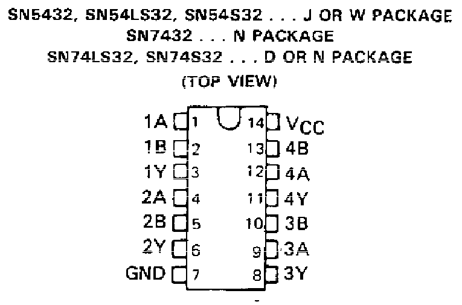
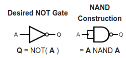
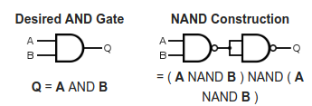
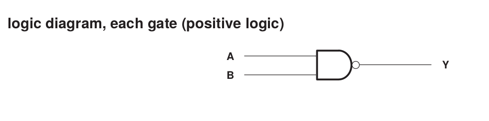
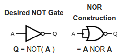
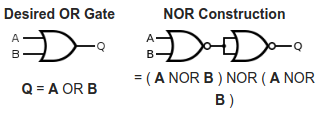

{width="3.0271817585301837in"
height="1.2133234908136483in"}

**CIRCUITOS DIGITAIS 2019.1**

**PRÁTICA 02 - MÓDULO DE CIRCUITOS DIGITAIS E INTRODUÇÃO À ALGEBRA DE
BOOLE**

**OBJETIVOS**

Apresentar o módulo de eletrônica digital e suas principais
funcionalidades;

Conhecer a álgebra de Boole;

Conhecer a variedade de portas lógicas disponı́veis e suas combinações;

Verificar os métodos de criação e simplificação da Tabela da verdade;

**Material Necessário:**

Kit Digital;

TTL 74LS00;

TTL 74LS04;

TTL 74LS08;

TTL 74LS32;

**Questionário pré-laboratório**

1.  Quais são as funções lógicas básicas da álgebra de Boole?

2.  Descreva as principais propriedades das operações da álgebra de
    > Boole.

3.  Quais funções lógicas básicas podem representar todas as outras
    > funções lógicas básicas

**PARTE 2 - IMPLEMENTAÇÃO DE CIRCUITO LÓGICO**

Represente a expressão lógica correspondente ao circuito a seguir.
Preencha também sua tabela verdade.

{width="5.894890638670166in"
height="2.280099518810149in"}

Usando os circuitos integrados a seguir, implementar no KIT o circuito
digital correspondente às portas lógicas descritas acima:

CIs Lógicos: **7404 (6-NOT), 7408 (4-AND), 7432 (4-OR)**

  **74LS04**   {width="1.747260498687664in" height="1.6773709536307961in"}{width="2.2804702537182853in" height="1.6773709536307961in"}
  ------------ -----------------------------------------------------------------------------------------------------------------------------------------------------------------------------------
  **74LS08**   {width="1.993305993000875in" height="1.6565376202974629in"}{width="2.683132108486439in" height="1.7502876202974629in"}
  **74LS32**   {width="1.8323906386701663in" height="1.8227963692038496in"}{width="2.6589063867016622in" height="1.7502876202974629in"}

**PARTE 3 - CONVERSÃO DE CIRCUITO LÓGICO PARA NAND**

Sem desmontar o circuito implementado com as portas NOT, AND e OR faça a
conversão do circuito lógico para portas NAND. Use os exemplos a seguir:

{width="2.6041666666666665in"
height="1.2083333333333333in"}{width="3.59375in"
height="1.21875in"}{width="3.5104166666666665in"
height="1.5625in"}

  EXPRESSÃO LÓGICA   
  ------------------ --
  CIRCUITO (NAND)    

Implemente o circuito lógico com NAND no KIT. Compare as entradas/saídas
dos dois circuitos montados simultaneamente:

{width="3.850386045494313in"
height="0.7288790463692039in"}{width="2.7386395450568677in"
height="2.4939107611548557in"}

**PARTE 4 (PÓS-LABORATÓRIO) - CONVERSÃO DE CIRCUITO LÓGICO PARA NOR**

Implemente a expressão lógica e o circuito equivalente utilizando portas
NOR a seguir:

  EXPRESSÃO LÓGICA   
  ------------------ --
  CIRCUITO (NOR)     

{width="2.6875in"
height="1.1979166666666667in"}{width="3.4791666666666665in"
height="1.59375in"}{width="3.3333333333333335in"
height="1.1770833333333333in"}
