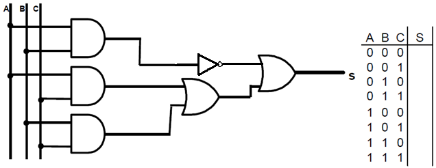
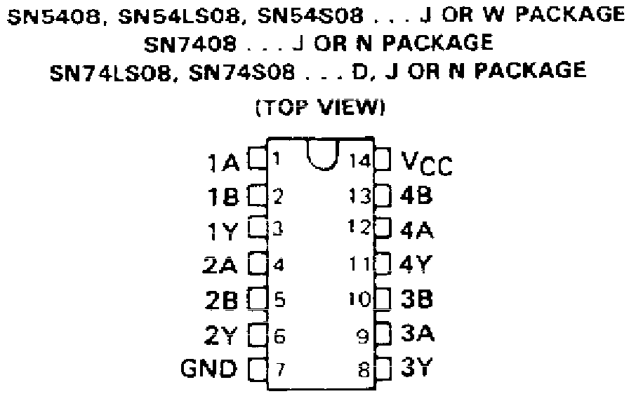
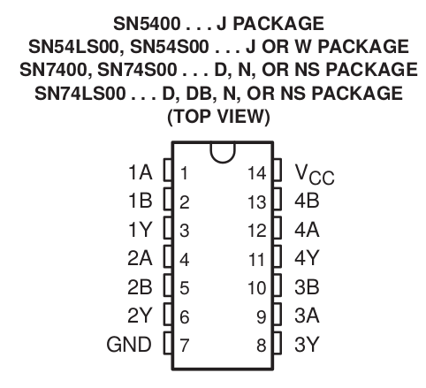
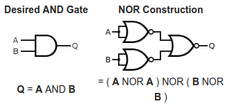

  

   
 

# PRÁTICA 02 - MÓDULO DE CIRCUITOS DIGITAIS E INTRODUÇÃO À ALGEBRA DE BOOLE

[Voltar à home](../)
[Aula Anterior](./pr01.md) - [Próxima Aula](./pr03.md)

## OBJETIVOS

- Apresentar o módulo de eletrônica digital e suas principais funcionalidades;
- Conhecer a álgebra de Boole;
- Conhecer a variedade de portas lógicas disponı́veis e suas combinações;
- Verificar os métodos de criação e simplificação da Tabela da verdade;

## Material Necessário:

- Kit Digital;
- [TTL 74LS00](../assets/datasheets/SN74HC00N.pdf);
- [TTL 74LS04](../assets/datasheets/SN74HC04N.pdf);
- [TTL 74LS08](../assets/datasheets/SN74HC08N.pdf);
- [TTL 74LS32](../assets/datasheets/SN74HC32N.pdf);

## Questionário pré-laboratório

1.  Quais são as funções lógicas básicas da álgebra de Boole?
2.  Descreva as principais propriedades das operações da álgebra de Boole.
3.  Quais funções lógicas básicas podem representar todas as outras funções lógicas básicas

## IMPLEMENTAÇÃO DE CIRCUITO LÓGICO

Represente a expressão lógica correspondente ao circuito a seguir. Preencha também sua tabela verdade.

|A|B|C|S|
|:-:|:-:|:-:|:-:|
|0 |0 |0 |
|0 |0 |1 |
|0 |1 |0 |
|0 |1 |1 |
|1 |0 |0 |
|1 |0 |1 |
|1 |1 |0 |
|1 |1 |1 |

Usando os circuitos integrados a seguir, implementar no KIT o circuito digital correspondente às portas lógicas descritas acima:

CIs Lógicos: **7404 (6-NOT), 7408 (4-AND), 7432 (4-OR)**

  | **74LS04**  | |
  | :-: | :-: |
  | |  |

  | **74LS08** | |
  | :-: | :-: |
  |  |  |

  | **74LS32** | |
  | :-: | :-: |
  |  |  |

## CONVERSÃO DE CIRCUITO LÓGICO PARA NAND

Sem desmontar o circuito implementado com as portas *NOT*, *AND* e *OR* faça a conversão do circuito lógico para portas NAND. Use os exemplos a seguir:

| **NOT** | **AND**| **OR** |
| :-: |  :-: | :-: |
| | | |

  | EXPRESSÃO LÓGICA  | _____________________________|
  | :-: |  :-: |

## CIRCUITO (NAND)    

Implemente o circuito lógico com NAND no KIT. Compare as entradas/saídas
dos dois circuitos montados simultaneamente:

| **TTL 74LS00** | |
| :-: |  :-: |
| |  |

## PÓS-LABORATÓRIO - CONVERSÃO DE CIRCUITO LÓGICO PARA NOR

Implemente a expressão lógica e o circuito equivalente utilizando portas NOR a seguir:

| EXPRESSÃO LÓGICA  | _____________________________|
| :-: |  :-: |

| | CIRCUITO (NOR) | |
| :-: |  :-: | :-: |
|  |  |  |    
