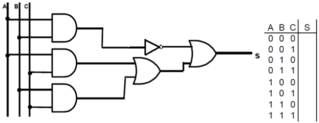
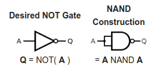
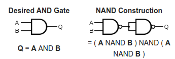
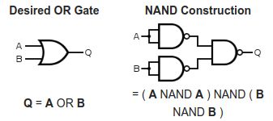
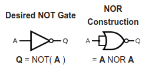
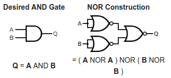
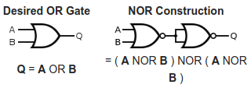

  

   
 

# PRÁTICA 02b - SIMULADOR DE CIRCUITOS DIGITAIS

[Voltar à home](../)
[Aula Anterior](./pr01.md) - [Próxima Aula](./pr03.md)

## OBJETIVOS

- Apresentar o simulador de circuitos digitais para uso na disciplina (remota);
- Conhecer a álgebra de Boole;
- Conhecer a variedade de portas lógicas disponı́veis e suas combinações;
- Verificar os métodos de criação e simplificação da Tabela da verdade;

## Material Necessário:

- Simulador de circuitos digitais [LOGISIM](http://www.cburch.com/logisim/pt/index.html);

## Operações e Portas Lógicas

## Operação E (AND)

- É a primeira das três operações fundamentais da Álgebra Booleana;
- Pode ser interpretada como:
	- **verdade (1) apenas quando ambos os
operadores forem verdadeiros**
- Representa a operação E lógico;
- Representações alternativas:
   - **E, AND,** **.** (ponto), **∧**
   - Em expressões/funções Booleanas, a ausência de operador significa que o operador E deve ser inferido

### Tabela Verdade:

| A | B | A (**e**) B|
| :--:| :--: | :--: |
| 0 | 0 | 0 |
| 0 | 1 | 0 |
| 1 | 0 | 0 |
| 1 | 1 | 1 |

## Operação OU (OR)

- Segunda operação fundamental. Pode ser interpretada como:
  - **“verdade (1) quando qualquer dos operadores for verdadeiro”**
- Representa o OU lógico;
- Representações alternativas:
   - **OU, OR, +, ∨**

### Tabela Verdade:

| A | B | A (**ou**) B|
| :--:| :--: | :--: |
| 0 | 0 | 0 |
| 0 | 1 | 1 |
| 1 | 0 | 1 |
| 1 | 1 | 1 |

## Operação NÃO (NOT)

- Terceira e última das operações fundamentais;
- Pode ser interpretada como:
	 - **“complemento ou inverso do valor atual”**
- Representa o NÃO lógico;
- Representações alternativas:
   - **NÃO, NOT, ~, ¬**
- Há uma notação muito usada na qual a operação **"não"** é representada com uma barra sobre a variável Booleana. Ex: **Ā**

### Tabela Verdade:

| A | **não** A |
| :--:| :--: |
| 0 | 1 |
| 1 | 0 |

## Questionário pré-laboratório

1.  Quais são as funções lógicas básicas da álgebra de Boole?
2.  Descreva as principais propriedades das operações da álgebra de Boole.
3.  Quais funções lógicas básicas podem representar todas as outras funções lógicas básicas

## PARTE 1 - IMPLEMENTAÇÃO DE CIRCUITO LÓGICO

Represente a expressão lógica correspondente ao circuito a seguir. Preencha também sua tabela verdade.

|A|B|C|S|
|:-:|:-:|:-:|:-:|
|0 |0 |0 |
|0 |0 |1 |
|0 |1 |0 |
|0 |1 |1 |
|1 |0 |0 |
|1 |0 |1 |
|1 |1 |0 |
|1 |1 |1 |

Implementar o circuito acima no [Logisim](http://www.cburch.com/logisim/pt/index.html)

## PARTE 2 - CONVERSÃO DE CIRCUITO LÓGICO PARA NAND E NOR
### CONVERSÃO DE CIRCUITO LÓGICO PARA NAND

Faça a conversão do circuito lógico para portas NAND. Use os exemplos a seguir:

| **NOT** | **AND**| **OR** |
| :-: |  :-: | :-: |
| | | |

> EXPRESSÃO LÓGICA : _____________________________

### CONVERSÃO DE CIRCUITO LÓGICO PARA NOR

Implemente a expressão lógica e o circuito equivalente utilizando portas NOR a seguir:

> EXPRESSÃO LÓGICA : _____________________________

| | CIRCUITO (NOR) | |
| :-: |  :-: | :-: |
|  |  |  |    

## IMPLEMENTAÇÃO DO CIRCUITO COM PORTAS NAND E NOR

Implemente o circuito modificado com portas NAND e NOR no [Logisim](http://www.cburch.com/logisim/pt/index.html).
