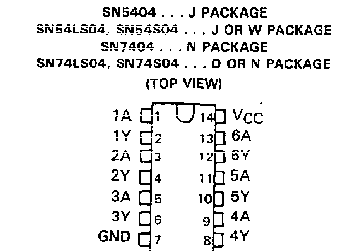

  
  
   
 

# PRÁTICA 03 - CONSTRUÇÃO DE CIRCUITOS COMBINACIONAIS

[Voltar à home](../)

**OBJETIVOS**

Resolução de problemas práticos utilizando circuitos lógicos;

Apresentar a metodologia de projeto de circuitos digitais com
ferramentas de simplificação algébrica;

**Material Necessário:**

• Kit Digital;

• TTL 74LS00;

• TTL 74LS02;

• TTL 74LS04;

• TTL 74LS08;

• TTL 74LS32

Durante o nosso estudo até agora, nos dedicamos à representação e
simplificação de grandezas digitais. Agora, buscaremos a aplicação dos
conceitos da eletrônica digital na solução de problemas práticos de
engenharia utilizando a classe de circuitos chamados **combinacionais**.
Um circuito combinacional é aquele em que as saı́das dependem única e
exclusivamente das combinações entre as variáveis de entrada; Para a
elaboração desses circuitos a partir de processos reais, normalmente
seguimos a seguinte sequência de passos:

1.  Problema real - Problema prático que visa solução usando o circuito
    > combinacional;

2.  Visão geral de variáveis e convenções - Definição de quais são as
    > entradas e saı́das do problema;

3.  Tabela verdade - Expressão que mostra todas as possı́veis saı́das para
    > todas as entradas possı́veis;

4.  Expressão mı́nima - Simplificação da tabela da verdade para uma
    > solução ótima;

5.  Solução do problema - Hardware que soluciona o problema real em
    > termos de entradas booleanas.

6.  

### PROBLEMA 1 

Uma fábrica necessita de uma sirene para indicar o fim do expediente.
Esta sirene deve ser tocada em uma das seguintes condições:

-   Já passa das cinco horas e todas as máquinas estão desligadas.

-   É sexta-feira, a produção do dia foi atingida e todas as máquinas
    > estão desligadas.

Projete um circuito que controle a sirene atribuindo as seguintes
variáveis booleanas. Preencha seu mapa-K.

– A - Já passa das cinco horas.

– B - Todas as máquinas estão desligadas.

– C - É sexta-feira.

– D -Produção do dia foi atendida.

– S - Tocar a Sirene.

                $$   $D$   $\text{CD}$   $C$
  ------------- ---- ----- ------------- -----
  $$                                     
  $B$                                    
  $\text{AB}$                            
  $A$                                    

Determine a expressão lógica para o circuito acima:
\_\_\_\_\_\_\_\_\_\_\_\_\_\_\_\_\_\_\_\_\_\_\_\_\_\_\_\_\_\_\_\_

Represente o diagrama do circuito usando portas lógicas. Em seguida,
implemente o circuito em protoboard.

  --
  --

  **7404**   {width="1.747260498687664in" height="1.6773709536307961in"}{width="2.2804702537182853in" height="1.6773709536307961in"}
  ---------- ----------------------------------------------------------------------------------------------------------------------------------------------------------------------------------
  **7408**   

{width="2.683132108486439in" height="1.7502876202974629in"}
  **7432**   

### PROBLEMA 2 

Uma companhia instituiu o seguinte controle para o acesso de seus três
estacionamentos. Cada empregado tem um cartão que deve ser inserido numa
brecha especial que existe em cada portão. O portão só abre se o
empregado estiver autorizado a usar o estacionamento.

Escreva o mapa-K para as três entradas x~1~, x~2~ e x~3~, representar a
expressão lógica do circuito e implemente em protoboard.

Expressão lógica:
\_\_\_\_\_\_\_\_\_\_\_\_\_\_\_\_\_\_\_\_\_\_\_\_\_\_\_\_\_\_\_\_\_\_\_\_\_\_\_\_\_\_\_\_\_\_\_\_\_\_\_\_\_\_\_

Represente o diagrama do circuito usando portas lógicas. Em seguida,
implemente o circuito em protoboard.

  --
  --

PÓS LABORATÓRIO - RELATÓRIO

1.  Para os dois circuitos implementados na prática, utilizar ferramenta
    > de construção de circuitos digitais para representar o circuito

2.  Represente, também, as expressões lógicas como Soma de Produtos
    > (mintermos) e Produtos de Somas (maxtermos);

3.  Elabore os dois circuitos da prática utilizando a conversão para
    > NAND/NOR

    a.  Circuito 1 e 2 - apenas portas NAND;

    b.  Circuito 1 e 2 - apenas portas NOR;

4.  Encontre a representação mínima dos circuitos utilizando NAND e NOR.

