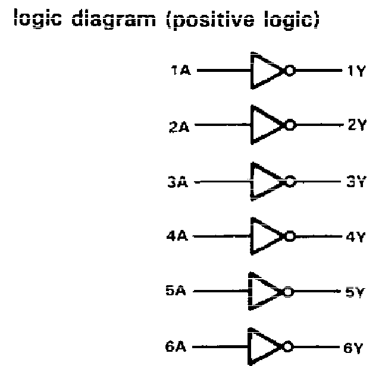
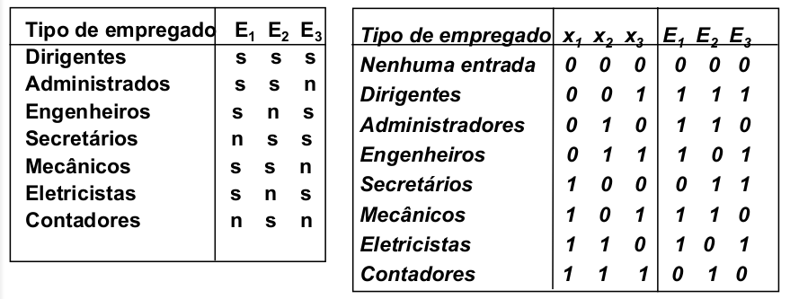

  

   
 

# PRÁTICA 03 - CONSTRUÇÃO DE CIRCUITOS COMBINACIONAIS USANDO SIMULADOR

[Voltar à home](../)
[Aula Anterior](./pr02.md) - [Próxima Aula](./pr04.md)

## OBJETIVOS

- Resolução de problemas práticos utilizando circuitos lógicos;
- Apresentar a metodologia de projeto de circuitos digitais com ferramentas de simplificação algébrica;

## Material Necessário:

Simuladores:
- [Simulador de circuitos digitais *Digital*](https://github.com/marcielbp/Digital)

Circuitos
- [TTL 74LS00](../assets/datasheets/SN74HC00N.pdf);
- [TTL 74LS04](../assets/datasheets/SN74HC04N.pdf);
- [TTL 74LS08](../assets/datasheets/SN74HC08N.pdf);
- [TTL 74LS32](../assets/datasheets/SN74HC32N.pdf);

## INTRODUÇÃO

Durante o nosso estudo até agora, nos dedicamos à representação e simplificação de grandezas digitais. Agora, buscaremos a aplicação dos conceitos da eletrônica digital na solução de problemas práticos utilizando a classe de circuitos chamados **combinacionais**.

Um circuito combinacional é aquele em que as saı́das dependem única e exclusivamente das combinações entre as variáveis de entrada; Para a elaboração desses circuitos a partir de processos reais, normalmente seguimos a seguinte sequência de passos:

1.  Problema real - Problema prático que visa solução usando o circuito combinacional;
2.  Visão geral de variáveis e convenções - Definição de quais são as entradas e saı́das do problema;
3.  Tabela verdade - Expressão que mostra todas as possı́veis saı́das para todas as entradas possı́veis;
4.  Expressão mı́nima - Simplificação da tabela da verdade para uma solução ótima;
5.  Solução do problema - Hardware que soluciona o problema real em termos de entradas *booleanas*.

## PROBLEMA 1

Uma fábrica necessita de uma sirene para indicar o fim do expediente. Esta sirene deve ser tocada em uma das seguintes condições:

-   Já passa das cinco horas e todas as máquinas estão desligadas.
-   É sexta-feira, a produção do dia foi atingida e todas as máquinas estão desligadas.

Projete um circuito que controle a sirene atribuindo as seguintes variáveis *booleanas*. Preencha sua tabela-verdade.

- A - Já passa das cinco horas.
- B - Todas as máquinas estão desligadas.
- C - É sexta-feira.
- D - Produção do dia foi atendida.
- S - Tocar a Sirene.

1. Determine a expressão lógica para o circuito acima:
| EXPRESSÃO LÓGICA  |
|  :-: |
| _____________________________|

2. Represente o diagrama do circuito usando portas lógicas no [Simulador de circuitos digitais *Digital*](https://github.com/marcielbp/Digital). Salve em um arquivo nomeado `pr03_prob1-1.dig`. Ponha o nome da equipe como texto no circuito.
3. Implemente o mesmo circuito utilizando os CIs lógicos a seguir em vez de portas lógicas. Salve em um arquivo nomeado `pr3_prob1-2.dig`. Ponha o nome da equipe como texto no circuito.

CIs Lógicos: **7404 (6-NOT), 7408 (4-AND), 7432 (4-OR)**

  | **74LS04**  | |
  | :-: | :-: |
  | |  |

  | **74LS08** | |
  | :-: | :-: |
  |  |  |

  | **74LS32** | |
  | :-: | :-: |
  |  |  |

### PROBLEMA 2

Uma companhia instituiu o seguinte controle para o acesso de seus três estacionamentos. Cada empregado tem um cartão que deve ser inserido numa brecha especial que existe em cada portão. O portão só abre se o empregado estiver autorizado a usar o estacionamento.

1. Escreva o mapa-K para as três entradas $x_1$, $x_2$ e $x_3$, representar a expressão lógica do circuito e implemente em protoboard.

| EXPRESSÃO LÓGICA  |
|  :-: |
| _____________________________

2. Represente o diagrama do circuito usando portas lógicas no simulador. Salve em um arquivo nomeado `pr3_prob2-1.dig`. Ponha o nome da equipe como texto no circuito.
3. Em seguida, implemente o circuito combinacional utilizando o [Simulador de circuitos digitais *Digital*](https://github.com/marcielbp/Digital) e os CIs lógicos utilizados no problema 1. Salve em um arquivo nomeado `pr3_prob2-2.dig`. Ponha o nome da equipe como texto no circuito.

## PÓS LABORATÓRIO - RELATÓRIO

1.  Envie o relatório da prática e os arquivos em um **único arquivo zipado** até o dia 14/02/2021. O relatório deve estar de acordo com [este modelo](https://marcielbp.github.io/Circuits/lab/pr02c) **em docx ou pdf** e os arquivos de simulação em formato **.dig**.
