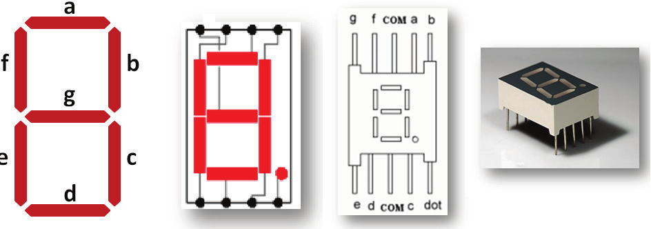
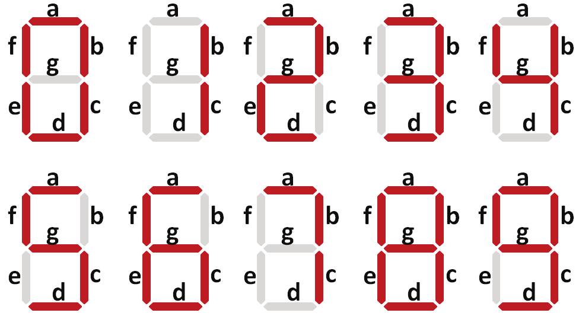
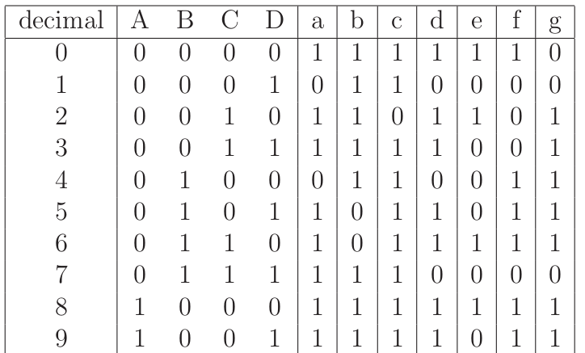

  
  
   
 

# PRÁTICA 04 - BCD E DISPLAY 7 SEGMENTOS

[Voltar à home](../) - [Aula Anterior](./pr03.md) - [Próxima Aula](./pr05.md)

**OBJETIVOS**

• Verificar o funcionamento de um multiplexador 3:8;

• Analisar o funcionamento de decodificadores BCD para display de sete
segmentos;

• Implementar um conversor de código binário para Gray.

**Material Necessário:**

- [Simulador de circuitos digitais *Digital*](https://github.com/marcielbp/Digital)

### INTRODUÇÃO

Codificadores e decodificadores são circuitos integrados que implementam funções lógicas responsáveis por modificar sequências lógicas (binárias) para aplicações específicas, seja relacionadas à comunicação, exibição ou proteção de dados. Um código binário muito utilizado na prática refere-se ao código de acionamento de displays de sete segmentos.

Fundamentalmente, um display de sete segmentos nada mais é que um conjunto de 7 LEDs dispostos de maneira fixa a formar um 8. Os LEDs podem ser acionados individualmente permitindo que quantidades em decimal, binário Octal ou até mesmo Hexadecimal sejam apresentados. Em sua realização mais comum eles podem ser o que se convencionou chamar de anodo comum ou catodo comum o que corresponde a dizer que os LEDs são acionados via nı́vel lógico "0" e "1" respectivamente.

Quatro representações do display de sete segmentos. Da esquerda para a direita: 
a. Nomeação usando letras para cada um dos segmentos; 
b. ligação usual dos LEDs com os terminadores do componente; 
c. esquema do componente apresentando dois terminais comuns (com = terra) e, finalmente;
d. uma foto do componente real.

Padrões de ativação dos LEDs do display de 7 segmentos para representação dos dı́gitos decimais.

O código de 7 segmentos fornece uma alternativa simples para implementação de circuitos que precisam fornecer dados numéricos de saı́da para o usuário. Veja a tabela de saída para um display 7 segmentos acima:

### DISPLAY 7 SEGMENTOS E CÓDIGO BCD

Implemente no Simulador um display que visualize todas as combinações BCD utilizando o circuito 7445 (decodificador BCD - 7 segmentos). Verifique todas as saı́das para todas as entradas possı́veis. Verifique também as entradas não válidas no código BCD

