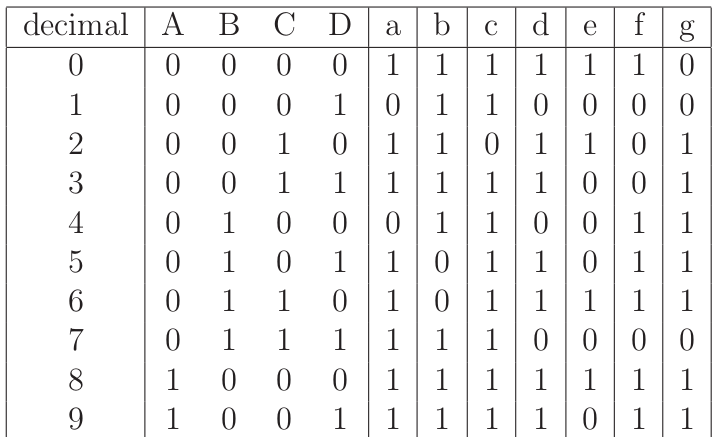

  
  
   
 

# PRÁTICA 04 - BCD E DISPLAY 7 SEGMENTOS

[Voltar à home](../) - [Aula Anterior](./pr03.md) - [Próxima Aula](./pr05.md)

**OBJETIVOS**

• Analisar o funcionamento de decodificadores BCD para display de 7 segmentos;
• Implementar no simulador um circuito para visualização de valores binário em display 7 segmentos.

**Material Necessário:**

- [Simulador de circuitos digitais *Digital*](https://github.com/marcielbp/Digital)

### INTRODUÇÃO

Codificadores e decodificadores são circuitos integrados que implementam funções lógicas responsáveis por modificar sequências lógicas (binárias) para aplicações específicas, seja relacionadas à comunicação, exibição ou proteção de dados. Um código binário muito utilizado na prática refere-se ao código de acionamento de displays de sete segmentos.

Fundamentalmente, um display de sete segmentos nada mais é que um conjunto de 7 LEDs dispostos de maneira fixa a formar um 8. Os LEDs podem ser acionados individualmente permitindo que quantidades em decimal, binário Octal ou até mesmo Hexadecimal sejam apresentados. Em sua realização mais comum eles podem ser o que se convencionou chamar de anodo comum ou catodo comum o que corresponde a dizer que os LEDs são acionados via nı́vel lógico "0" e "1" respectivamente.

Quatro representações do display de sete segmentos. Da esquerda para a direita: 
a. Nomeação usando letras para cada um dos segmentos; 
b. ligação usual dos LEDs com os terminadores do componente; 
c. esquema do componente apresentando dois terminais comuns (com = terra) e, finalmente;
d. uma foto do componente real.

Padrões de ativação dos LEDs do display de 7 segmentos para representação dos dı́gitos decimais.

O código de 7 segmentos fornece uma alternativa simples para implementação de circuitos que precisam fornecer dados numéricos de saı́da para o usuário. Veja a tabela de saída para um display 7 segmentos acima:

### DISPLAY 7 SEGMENTOS E CÓDIGO BCD

1. Verifique usando o [arquivo de simulação disponibilizado](https://raw.githubusercontent.com/marcielbp/Circuits/master/lab/pr04/dig/pr04-1.dig) todas as combinações BCD utilizando o circuito [7448](https://github.com/marcielbp/Circuits/raw/master/lab/pr04/media/74LS48.pdf) (decodificador BCD - 7 segmentos).

2. Altere o circuito 7448 para o circuito [**7447**](https://github.com/marcielbp/Circuits/raw/master/lab/pr04/media/74LS47.pdf) (veja diagrama de E/S abaixo). O que acontece com as saídas? Como produzir uma saída correta em display 7 segmentos?

3. Implemente um circuito utilizando qualquer conjunto de portas lógicas que seja capaz de, a partir de uma entrada de 4 bits, exibir, no display 7 segmentos, **apenas** os valores em hexadecimal `A,B,C,D,E` e `F`, como na figura a seguir:

> Dica: implemente um mapa-K para cada um dos 7 segmentos do display para criar esse circuito. É possível utilizar um decodificador 7447 ou 7448 para exibir esses digitos?

4. Pesquise sobre os seguintes termos: **Cátodo Comum** e **Ânodo Comum**. Qual a diferença entre eles?

5. Pesquise sobre a definição para Coletor **Aberto** e Coletor **Fechado**.

Mais informações:
- [https://wiki.sj.ifsc.edu.br/index.php/Display_de_7_segmentos](https://wiki.sj.ifsc.edu.br/index.php/Display_de_7_segmentos)

