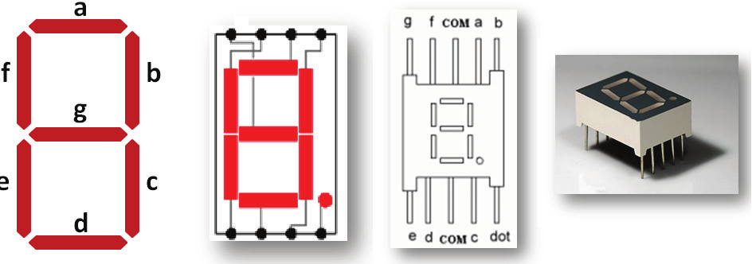
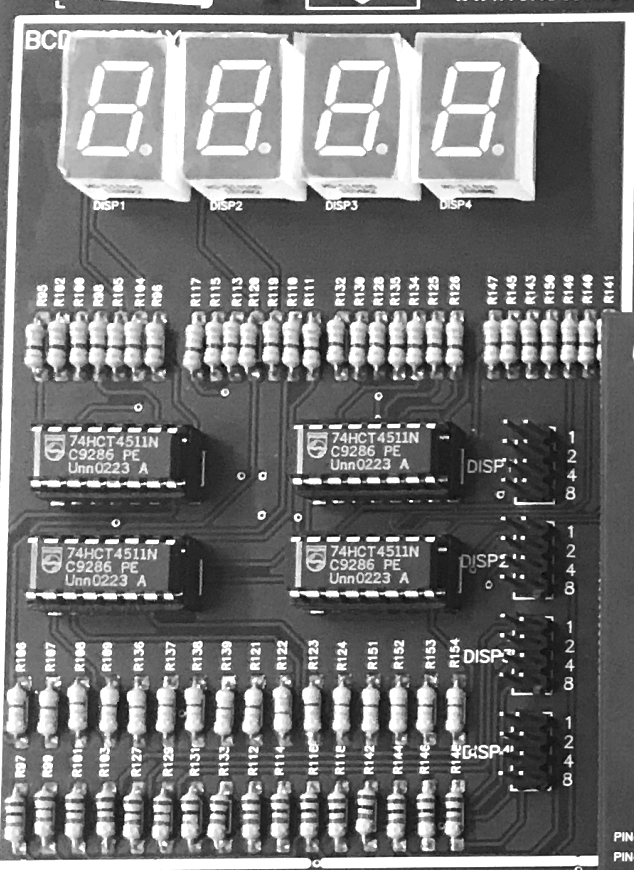
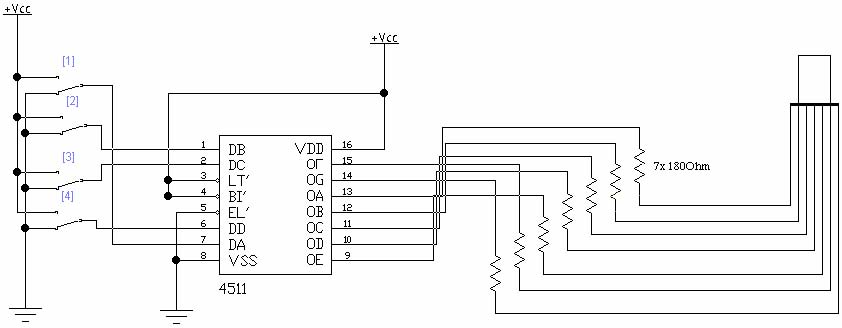

  
  
   
 

# PRÁTICA 04 - BCD E DISPLAY 7 SEGMENTOS

[Voltar à home](../)

**OBJETIVOS**

• Verificar o funcionamento de um multiplexador 3:8;

• Analisar o funcionamento de decodificadores BCD para display de sete
segmentos;

• Implementar um conversor de código binário para Gray.

**Material Necessário:**

• Kit Digital;

• Display de sete segmentos catodo comum;

• Sete resistores de 150 OHMs;

• 01 TTL 74LS138;

• 01 CMOS 4511 do KIT

• 01 CI 74LS86

### INTRODUÇÃO

Codificadores e decodificadores são circuitos integrados que implementam
funções lógicas responsáveis por modificar sequências lógicas (binárias)
para aplicações específicas, seja relacionadas à comunicação, exibição
ou proteção de dados. Um código binário muito utilizado na prática
refere-se ao código de acionamento de displays de sete segmentos

Fundamentalmente, um display de sete segmentos nada mais é que um
conjunto de 7 LEDs dispostos de maneira fixa a formar um 8. Os LEDs
podem ser acionados individualmente permitindo que quantidades em
decimal, binário Octal ou até mesmo Hexadecimal sejam apresentados. Em
sua realização mais comum eles podem ser o que se convencionou chamar de
anodo comum ou catodo comum o que corresponde a dizer que os LEDs são
acionados via nı́vel lógico "0" e "1" respectivamente.

Quatro representações do display de sete segmentos. Da esquerda para a
direita: a) Nomeação usando letras para cada um dos segmentos; b)
ligação usual dos LEDs com os terminadores do componente; c) esquema do
componente apresentando dois terminais comuns (com = terra) e finalmente
d) uma foto do componente real.

Padrões de ativação dos LEDs do display de 7 segmentos para
representação dos dı́gitos decimais.

O código de 7 segmentos fornece uma alternativa simples para
implementação de circuitos que precisam fornecer dados numéricos de
saı́da para o usuário. Veja a tabela de saída para um display 7 segmentos
acima:

### CODIFICADOR 3:8

O circuito codificador 74138 ativa o nível lógico baixo para uma das
oito saídas Y0-Y7 apenas quando o endereço correspondente estiver
ativado. Implemente, utilizando o CI 74138, um circuito que realiza a
multiplexação de uma entrada para alguma das 8 saídas.

Verifique a influência da mudança do nível lógico apenas do pino G1
sobre o comportamento das saídas multiplexadas.

### 

Em seguida, conecte o pino G1 ao gerador de frequência da placa.
Introduza como entrada os pinos correspondentes a 0,5 Hz e 1 Hz (ciclos
por segundo).

### DISPLAY 7 SEGMENTOS E CÓDIGO BCD

Implemente no Kit um display que visualize todas as combinações BCD
utilizando o CI 4511 (decodificador BCD - 7 segmentos). Verifique todas
as saı́das para todas as entradas possı́veis.

Verifique também as entradas não válidas no código BCD

### CÓDIGO GRAY

O código de Gray inventado por Frank Gray é um código binário refletivo
(RBC - Reflected Binary Code) no qual apenas um bit muda na
representação de uma entre números sucessivos. Projete um decodificador
que efetue a conversão do código Gray de quatro bits para o sistema
binário comum de quatro bits. Represente as saídas do código Gray em 4
bits e compare com a saída obtida no circuito implementado:

Em seguida, monte o decodificador Gray utilizando o circuito a seguir.
Conecte a saída do circuito decodificador ao driver do display 7
segmentos visto no início da prática.

Circuito correspondente ao decodificador Gray

PÓS LABORATÓRIO - RELATÓRIO

1.  Descreva os procedimentos de montagem realizados na prática. Comente
    > sobre dois tipos de displays 7 segmentos: catodo comum e anodo
    > comum. Qual a diferença e aplicabilidade entre eles?

2.  Pesquise circuitos lógicos que recebam número binário em 4 bits e
    > convertam em hexadecimal para exibição em display 7 segmentos.
    > Exemplo de exibição:

1.  Construa um circuito, utilizando portas lógicas básicas (NOT, AND e
    > OR) que implemente um decodificador 3:8 tal como o CI 74138.
    > Represente o diagrama, a tabela verdade e implemente utilizando um
    > simulador. Mostre as saídas do simulador quando são modificadas as
    > entradas. Não esqueça de incluir o pino de sinal G1 e as entradas
    > G2 e G3.

2.  Implemente um circuito que realize a conversão de binário para
    > código Gray de 5 bits. Por sua vez, crie também o circuito
    > decodificador, mostrando as 32 entradas binárias, 32 saídas
    > intermediárias em gray e as 32 saídas decodificadas em binário.
    > Utilize portas lógicas básicas (NOT, AND e OR) e a porta XOR.

