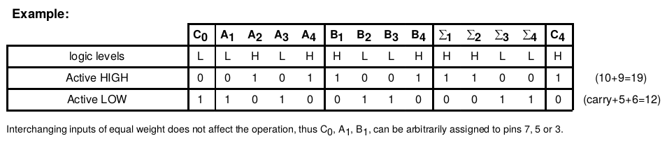
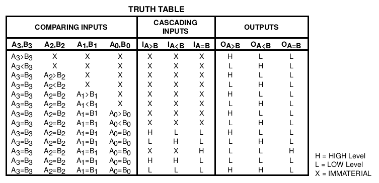

  
  
   
 

# PRÁTICA 05 - CIRCUITOS ARITMÉTICOS

[Voltar à home](../)

**OBJETIVOS**

• Verificar o funcionamento de um circuito somador e de um circuito
comparador;

• Fixar conceitos de operações com números binários, *carry in*, *carry
out* e *overflow*;

**Material Necessário:**

• Kit Digital;

• 01 TTL 74LS243;

• 01 TTL 74L85

***Exercícios pré-laboratório:***

1.  Determine o significado dos conceitos de *carry in,* *carry out* e
    > *overflow*, mostrando exemplos com números binários.

***PARTE 1 - CIRCUITO SOMADOR***

Um circuito combinacional aritmético implementa operações aritméticas
como adição, subtração, multiplicação e divisão com números binários.
Quando há uma soma binária em onde ambos os operandos são iguais a 1,
são necessários dois dı́gitos para expressar seu resultado. Neste caso, o
transporte (vai - um ou carry, em inglês) é somado ao próximo par mais
significativo de bits. Um circuito combinacional que implementa a adição
de dois bits é chamado meio-somador (half adder, em inglês). Um circuito
que implementa a adição de três bits (dois bits significativos e um
carry) é chamado de somador completo (full adder, em inglês). Estes
nomes decorrem do fato de que com dois meio-somadores pode-se
implementar um somador completo. O somador completo é um circuito
aritmético básico a partir do qual todos os outros circuitos aritméticos
são construı́dos.

Nesta prática será utilizado o meio somador de 4 bits com *carry in* e
*carry out* do circuito 74LS283.

***Prática***

Implemente um circuito somador de duas entradas de 4 bits
A~3~A~2~A~1~A~0~ e B~3~B~2~B~1~B~0~ cuja saída seja uma palavra binária
Σ~3~Σ~2~Σ~1~Σ~0~ e um bit de *carry out* C~1~. A entrada de carry in
C~0~ deve receber valor 0. Represente a saída binária nos leds do kit
utilizando a sequência de exibição horizontal C~1~Σ~3~Σ~2~Σ~1~Σ~0~.
Escolha 16 pares de valores em 4 bits para as variáveis A e B e
apresente uma tabela com a saída do somador.

***DIAGRAMA 74LS283***

***PARTE 2 - CIRCUITO COMPARADOR***

Um comparador é um circuito combinatório que permite comparar o valor
absoluto de dois inteiros A e B representados em binário com n-bits. Tem
três saı́das que indicam respectivamente se A&lt;B, A=B ou A&gt;B.

O circuito comparador da prática é implementado pelo CI 74LS85, que
dispõe de duas entradas de 4 bits, 3 pinos de entrada e 3 pinos de saída
de comparação. Os pinos de entrada podem ser utilizados para utilização
de múltiplos circuitos.

Implemente no Kit um circuito comparador utilizando o CI CI 74LS85 de
duas entradas de 4 bits A~3~A~2~A~1~A~0~ e B~3~B~2~B~1~B~0~ . Ligue as
entradas I~A=B~, I~A&gt;B~ e I~A&lt;B~ em três chaves ligadas com níveis
lógicos HLL, respectivamente.

Escolha um conjunto de 16 pares de entrada e escreva a tabela de saída
das portas O~A=B~, O~A&gt;B~ e O~A&lt;B~

***PÓS LABORATÓRIO - RELATÓRIO***

1.  Descreva os procedimentos de montagem realizados na prática. Comente
    > o significado dos pinos C~0~ e C~1~ do circuito somador e sobre as
    > entradas I~A=B~, I~A&gt;B~ e I~A&lt;B~ e saídas O~A=B~, O~A&gt;B~
    > e O~A&lt;B~ do circuito comparador;

2.  Elabore um circuito portas lógicas básicas (AND, OR e NOT)
    > **comparador** de dois bits que receba duas entradas lógicas de
    > dois bits A~1~A~0~ e B~1~B~0~ e os três bits de entrada I~A=B~,
    > I~A&gt;B~ e I~A&lt;B~ e retorne o resultado da comparação na forma
    > O~A=B~, O~A&gt;B~ e O~A&lt;B~. Representar a tabela verdade do
    > circuito.

3.  Construa um circuito que receba uma entrada de dois bits A~1~A~0~ e
    > um bit de sinal S~0~ e retorne uma saída de três bits B~2~B~1~B~0~
    > que equivale à entrada em formato complemento de dois. Se a
    > entrada for positiva, é mantida na saída da forma B~2~B~1~B~0~ =
    > **0** A~1~A~0~ e, caso seja negativa, B~2~B~1~B~0~ =
    > comp2(A~1~A~0~ )

4.  Elabore um circuito utilizando portas lógicas básicas (AND, OR e
    > NOT) **somador em complemento de dois** que receba duas entradas
    > lógicas de três bits A~2~A~1~A~0~ e B~2~B~1~B~0~ retorne a soma em
    > de A e B na forma Σ~2~Σ~1~Σ~0~ e um bit de carry out C~1~ e um bit
    > de overflow O~1~. O circuito deve ser capaz de somar números
    > positivos e negativos representados conforme representação a
    > seguir:

> -3 -2 -1 0 1 2 3 4
>
> 101 110 111 000 001 010 011 100
>
> Representar a tabela verdade do circuito.
