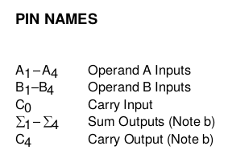
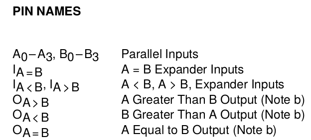

  
  
   
 

# PRÁTICA 05 - CIRCUITOS ARITMÉTICOS

[Voltar à home](../) - [Aula Anterior](./pr04.md) - [Próxima Aula](./pr06.md)

# OBJETIVOS
• Verificar o funcionamento de um circuito somador e de um circuito comparador;
• Fixar conceitos de operações com números binários, *carry in*, *carry out* e *overflow*;

## Material Necessário

- [Simulador de circuitos digitais *Digital*](https://github.com/marcielbp/Digital)
- 01 TTL [74243](https://github.com/marcielbp/Circuits/raw/master/lab/pr05/sn54ls283-sp.pdf);
- 01 TTL 7485
- Circuitos 7448 e display 7 segmentos utilizados na [aula anterior](./pr04.md)

### Exercícios pré-laboratório

1.  Determine o significado dos conceitos de *carry in,* *carry out* e *overflow*, mostrando exemplos com números binários.

## CIRCUITO SOMADOR

Um circuito combinacional aritmético implementa operações aritméticas como adição, subtração, multiplicação e divisão com números binários. Quando há uma soma binária em onde ambos os operandos são iguais a 1, são necessários dois dı́gitos para expressar seu resultado. Neste caso, o transporte (vai - um ou carry, em inglês) é somado ao próximo par mais significativo de bits. Um circuito combinacional que implementa a adição de dois bits é chamado meio-somador (half adder, em inglês). Um circuito que implementa a adição de três bits (dois bits significativos e um carry) é chamado de somador completo (full adder, em inglês). Estes nomes decorrem do fato de que com dois meio-somadores pode-se implementar um somador completo. O somador completo é um circuito aritmético básico a partir do qual todos os outros circuitos aritméticos são construı́dos.

Nesta prática será utilizado o meio somador de 4 bits com *carry in* e *carry out* do circuito 74283.

### Prática

Implemente um circuito somador utilizando o [74243](https://github.com/marcielbp/Circuits/raw/master/lab/pr05/sn54ls283-sp.pdf) com duas entradas de 4 bits $A_3A_2A_1A_0$ e B3B2B1B0 cuja saída seja uma palavra binária Σ3Σ2Σ1Σ0 e um bit de *carry out* C1. A entrada de carry in C0 deve receber valor 0. Represente a saída binária nos leds do kit utilizando a sequência de exibição horizontal C1Σ3Σ2Σ1Σ0. Apresente uma tabela com a saída do somador.

### DIAGRAMA 74LS283

## PARTE 2 - CIRCUITO COMPARADOR

Um comparador é um circuito combinatório que permite comparar o valor
absoluto de dois inteiros A e B representados em binário com n-bits. Tem
três saı́das que indicam respectivamente se A&lt;B, A=B ou A&gt;B.

O circuito comparador da prática é implementado pelo CI 74LS85, que
dispõe de duas entradas de 4 bits, 3 pinos de entrada e 3 pinos de saída
de comparação. Os pinos de entrada podem ser utilizados para utilização
de múltiplos circuitos.

Implemente no Kit um circuito comparador utilizando o CI CI 74LS85 de
duas entradas de 4 bits A~3~A~2~A~1~A~0~ e B~3~B~2~B~1~B~0~ . Ligue as
entradas I~A=B~, I~A&gt;B~ e I~A&lt;B~ em três chaves ligadas com níveis
lógicos HLL, respectivamente.

Escolha um conjunto de 16 pares de entrada e escreva a tabela de saída
das portas O~A=B~, O~A&gt;B~ e O~A&lt;B~

***PÓS LABORATÓRIO - RELATÓRIO***

1. Descreva os procedimentos de montagem realizados na prática. Comente o significado dos pinos C0 e C1 do circuito somador e sobre as entradas IA=B, IA&gt;B e IA&lt;B e saídas OA=B, OA&gt;B e OA&lt;B do circuito comparador; 

2.  Elabore um circuito portas lógicas básicas (AND, OR e NOT) **comparador** de dois bits que receba duas entradas lógicas de dois bits A1A0 e B1B0 e os três bits de entrada IA=B, IA&gt;B e IA&lt;B e retorne o resultado da comparação na forma OA=B, OA&gt;B e OA&lt;B. Representar a tabela verdade do circuito.

3.  Construa um circuito que receba uma entrada de dois bits A1A0 e um bit de sinal S0 e retorne uma saída de três bits B2B1B0 que equivale à entrada em formato complemento de dois. Se a entrada for positiva, é mantida na saída da forma B2B1B0 = **0** A1A0 e, caso seja negativa, B2B1B0 = comp2(A1A0 )

4.  Elabore um circuito utilizando portas lógicas básicas (AND, OR e NOT) **somador em complemento de dois** que receba duas entradas lógicas de três bits A2A1A0 e B2B1B0 retorne a soma em de A e B na forma Σ2Σ1Σ0 e um bit de carry out C1 e um bit de overflow O1. O circuito deve ser capaz de somar números positivos e negativos representados conforme representação a seguir:  > -3 -2 -1 0 1 2 3 4 > > 101 110 111 000 001 010 011 100 > > Representar a tabela verdade do circuito
