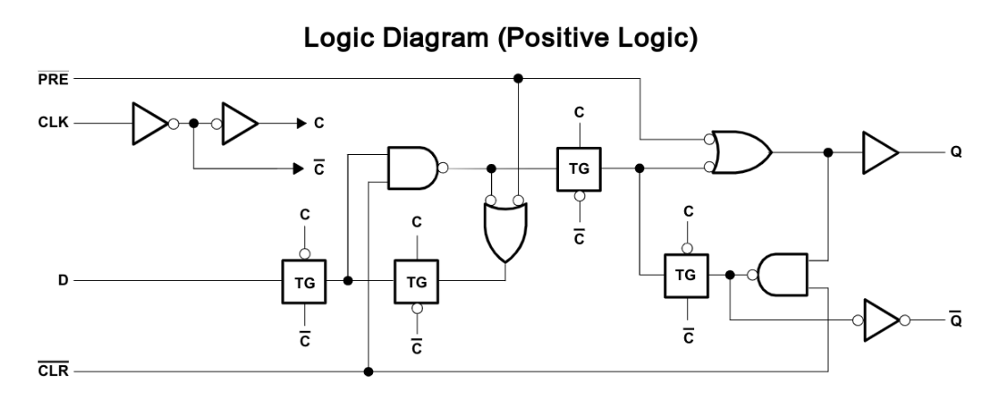

  
  
   
 

# PRÁTICA 06 - FLIP-FLOP TIPO D e JK

[Voltar à home](../) - [Aula Anterior](./pr05.md) - [Próxima Aula](./pr07.md)

## OBJETIVOS

- Observar e analisar os princı́pios de funcionamento dos Flip-flops e compreender o processo de armazenamento de informações utilizando portas lógicas.

## Material Necessário:
- [Simulador de circuitos digitais *Digital*](https://github.com/marcielbp/Digital)
- 01 [TTL 7476](https://github.com/marcielbp/Circuits/raw/master/lab/pr06/7473.pdf)
- 01 [TTL 7474](https://github.com/marcielbp/Circuits/raw/master/lab/pr06/SN74HC74N.pdf)

Vimos nas últimas práticas o funcionamento da lógica combinacional, ou ainda, uma lógica para a qual a saı́da é pré-determinada de forma unı́voca pelas entradas. Estes circuitos, no entanto, não apresentam qualquer presença de elemento que possa armazenar informações lógicas de entrada, ou seja, memória sobre os estados anteriores. Todo o desenvolvimento computacional e de comunicações digitais está suportado pela concepção de memória.

Circuitos lógicos sequenciais são categorias de circuitos que, utilizando portas lógicas, implementam sistemas de memória ao ponto de que, em geral, a saída do sistema depende do estado atual e de estados anteriores. O principal elemento de memória utilizado é o *Flip-Flop,* constituído por portas lógicas que, sozinhas, não têm capacidade de armazenamento, mas conectadas entre si transformam o circuito em um sistema dotado de memória.

## PARTE 1 - Flip-Flop tipo D

*Flip Flop* tipo D tem uma entrada chamada D (dados), uma entrada CLK (clock) e duas saídas correspondentes ao estado (Q) e seu complemento (Q’). Uma entrada
adicional chamada EN. Neste latch, o próximo estado Q(t+1) corresponde ao valor da entrada D(t). Dessa forma, o FF D é chamado FF de “retardo” ou “transparente”. O diagrama lógico é exibido a seguir:

Por sua vez, o circuito [TTL 7474](https://github.com/marcielbp/Circuits/raw/master/lab/pr06/SN74HC74N.pdf) implementa dois circuitos independentes Flip Flops tipo D com preset e clear. O diagrama de entrada e saída é mostrado a seguir:

O arquivo [Parte 1](./pr06/dig/pr06_p1.dig) contem dois flip-flops do tipo D, nao encapsulados como circuito integrado. O circuito implementa um contador de **dois bits**. Veja que, quando o circuito é ligado, o primeiro número a ser exibido é 3. Por sua vez, a implementação [Parte 2](./pr06/dig/pr06_p2.dig) tem a mesma funcionalidade da parte 1, porém, utilizando um circuito integrado em vez de flip-flop tipo D. Execute-o.

### Exercício Parte 1
- Implemente um contador de 0 a 7 utilizando flip flops tipo D como representado na [Parte 1](./pr06/dig/pr06_p1.dig)
- Implemente um contador de 0 a 7 utilizando o circuito 7474 como representado na [Parte 2](./pr06/dig/pr06_p2.dig)

## PARTE 2 - Flip-Flop tipo JK

Podemos, também, implementar contadores a partir de flip flops do tipo JK. É possível construir um contador para valores não multiplos de 2, utilizando uma lógica combinacional para o sinal de clear. Podemos implementar um contador desse tipo no modo **assíncrono**, ou seja, quando o sinal de clock não é comum a todos os flip flops. Observe [esta implementação do circuito](./pr06/dig/pr06_p3.dig), que implementa um contador de três bits, ou seja, cuja contagem inclui os números 0, 1, 2, 3, 4, 5, 6 e 7. 
Se quisermos implementar um contador de *módulo*, ou seja, que interrompa a contagem ao chegar em um determinado número, precisamos estabelecer qual a lógica a ser adicionada na entrada CLEAR.
Tomamos como base um contador `mod(5)`, que deve apresentar os números 0, 1, 2, 3 e 4. Observe a implementação [aqui](./pr06/dig/pr06_p4.dig) e veja que a contagem inclui esses números. Perceba que, nesse exemplo, deixa de existir um **estado** com todas as saídas em 1, que ocorre no momento que todos os flip flops estão recebendo um sinal de CLEAR porque o sinal SET também recebe a saída do circuito combinacional de reinício. Para modificarmos o MOD do contador, precisamos utilizar outra lógica para o CLEAR que faça zerar a contagem, ou seja, indicamos qual o valor que, se atingido, fará a contagem reiniciar.

No entanto, esse contador assíncrono irá indicar na sua saída, por um período muito breve, imperceptível no simulador, a saída da condição de reinício.

### Exercício Parte 2
- Qual lógica é necessária para implementar contador assíncrono de 4 bits `mod(x)`? represente qual lógica combinacional necessária para fazer a contagem de 0 a 9.
- Com base no circuito [TTL 7476](https://github.com/marcielbp/Circuits/raw/master/lab/pr06/7473.pdf), Implemente um contador de 0 a 9 utilizando flip flops tipo JK cuja saída seja um display de 7 segmentos. OBS: provavelmente será necessário ligar dois circuitos [TTL 7476](https://github.com/marcielbp/Circuits/raw/master/lab/pr06/7473.pdf) para representar todos os bits.

