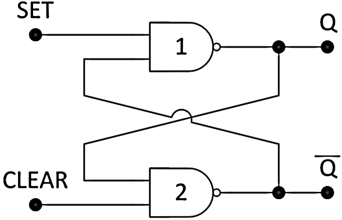
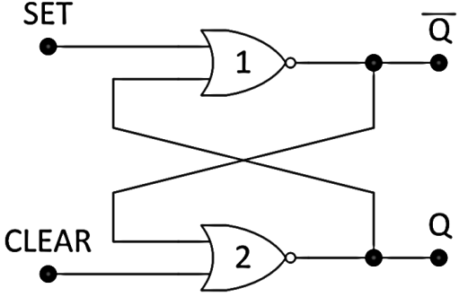
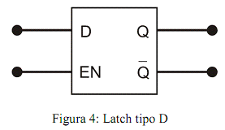
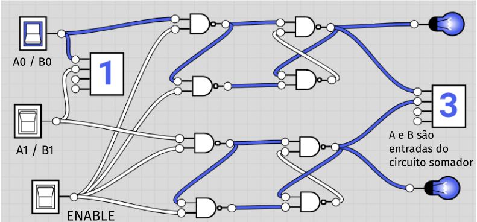
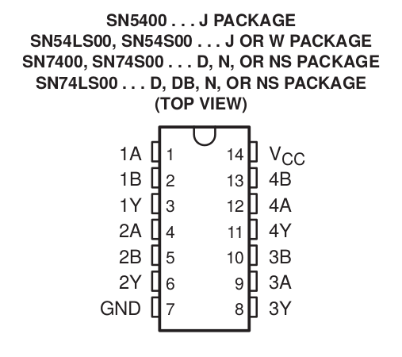

  
  
   
 

# PRÁTICA 06 - CIRCUITOS LÓGICOS SEQUENCIAIS - LATCHES - SR e D

[Voltar à home](../)

**OBJETIVOS**

• Observar e analisar os princı́pios de funcionamento dos Flip-flop’s e
compreender o processo de armazenamento de informações utilizando portas
lógicas.

**Material Necessário:**

• 02 TTL 74LS00;

• 01 TTL 74LS02;

• 01 TTL 74LS283

Vimos nas últimas práticas o funcionamento da lógica combinacional, ou
ainda, uma lógica para a qual a saı́da é pré-determinada de forma unı́voca
pelas entradas. Estes circuitos, no entanto, não apresentam qualquer
presença de elemento que possa armazenar informações lógicas de entrada,
ou seja, memória sobre os estados anteriores. Todo o desenvolvimento
computacional e de comunicações digitais está suportado pela concepção
de memória.

Circuitos lógicos sequenciais são categorias de circuitos que,
utilizando portas lógicas, implementam sistemas de memória ao ponto de
que, em geral, a saída do sistema depende do estado atual e de estados
anteriores. O principal elemento de memória utilizado é o *Flip-Flop,*
constituído por portas lógicas que, sozinhas, não têm capacidade de
armazenamento, mas conectadas entre si transformam o circuito em um
sistema dotado de memória.

Os elementos fundamentais para construção de *flip-flops* são chamados
*latches*, circuitos sequenciais com capacidade de armazenamento, que
serão estudados hoje.

***PARTE 1 - Latch tipo Set e Reset - SR***

O *Latch* é um dispositivo de armazenamento temporário que tem dois
estados estáveis (biestável). O *Latch* SR pode ser construído com
portas NAND, conforme figura a seguir. **Monte o circuito indicado e
preencha a tabela ao lado:**

**Construa o Latch SR com portas NOR e preencha a tabela ao lado:**

Observe, a partir das tabelas-verdade, que as entradas do *latch* com
portas NAND são ativas em nível baixo e as do *latch* com portas NOR são
ativas em nível alto. Podemos representar os dois tipos de latch
conforme descrito a seguir:

Latch **NAND** e Latch **NOR**, respectivamente

Verifique a relação das saídas Q e Q’, para os dois modelos de latch SR,
para um conjunto maior de configuração de entrada, como mostrado a
seguir:

  SET   CLEAR   $Q$   $$      SET   CLEAR   $Q$   $$
  ----- ------- ----- ---- -- ----- ------- ----- ----
  0     0                     0     1             
  0     1                     1     1             
  1     0                     0     0             
  1     1                     0     1             
  1     0                     1     1             
  0     0                     1     0             
  1     0                     0     0             
  1     1                     1     0             

Verifique se são notadas as condições mostradas a seguir:

**LATCH NAND LATCH NOR**

***PARTE 2 - Flip-Flop tipo D***

*Latch* tipo D tem uma entrada chamada D (dados) e duas saídas
correspondentes ao estado (Q) e seu complemento (Q’). Uma entrada
adicional chamada EN. Neste latch, o próximo estado Q(t+1) corresponde
ao valor da entrada D(t). Dessa forma, o latch D é chamado latch de
“retardo” ou “transparente”. O diagrama lógico é exibido a
seguir:

> Latch tipo D com portas NAND

> Latch tipo D com portas NOR, AND e NOT

O latch D pode ser construído a partir do latch SR conforme diagrama
lógico acima. Implemente um latch tipo D utilizando portas **NAND** e
preencha a tabela verdade a seguir:

  DATA   ENABLE   $Q$   $$      DATA   ENABLE   $Q$   $$
  ------ -------- ----- ---- -- ------ -------- ----- ----
  0      0                      0      1              
  0      1                      1      1              
  1      0                      0      0              
  1      1                      0      1              
  1      0                      1      1              
  0      0                      1      0              
  1      0                      0      0              
  1      1                      1      0              

Implemente também um segundo latch NAND, conforme ilustrado. Preencha a
tabela novamente

  DATA   ENABLE   $Q$   $$      DATA   ENABLE   $Q$   $$
  ------ -------- ----- ---- -- ------ -------- ----- ----
  0      0                      0      1              
  0      1                      1      1              
  1      0                      0      0              
  1      1                      0      1              
  1      0                      1      1              
  0      0                      1      0              
  1      0                      0      0              
  1      1                      1      0              

Exemplo do comportamento de um latch D para as formas de onda dadas:

***PARTE 3 - CIRCUITOS DIGITAIS COM MEMÓRIA:***

Sem desmontar os latches tipo D, implemente um somador de dois bits
usando o CI 74LS283. O somador deverá ser acionado por dois bits de
saída dos latches D e por duas entradas das chaves. Use as mesmas chaves
para inserir dados para os *latches* e para o somador, usando uma chave
extra de ENABLE para habilitar a gravação nos *latches* ou não. O
diagrama é representado a seguir:

PÓS LABORATÓRIO - RELATÓRIO:

1.  Faça o detalhamento, no relatório, dos procedimentos relativos à
    > montagem dos circuitos da prática. Exiba a tabela de saída obtida
    > dos circuitos.

2.  Descreva a importância do uso de *latches* e *flip-flops* na
    > implementação de circuitos que possuem memória. Quais são as
    > aplicações dos *latches* e *flip-flops*?

3.  Pesquise sobre memórias estáticas de acesso aleatório - SRAM. Como
    > essas memórias podem ser implementadas utilizando circuitos
    > lógicos?

4.  Implemente um circuito lógico que equivalha a um latch tipo D
    > utilizando APENAS portas NOR;

5.  Implemente um circuito somador que receba duas entradas sequenciais
    > de quatro bits, de modo que as chaves de inserção sejam
    > compartilhadas para as entradas A e B, ou seja, usando latches
    > tipo D para armazenagem.

DIAGRAMAS:

CIs Lógicos:

  **7400 - NAND**   
  

  **7402 - NOR**    

  **7404 - NOT**    

  **7408 - AND**    

