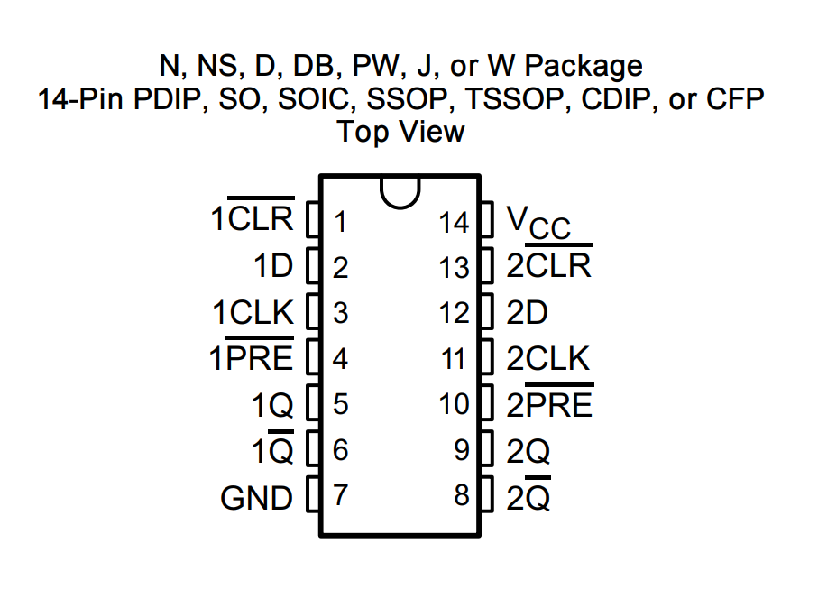

  
  
   
 

# PRÁTICA 06 - FLIP-FLOP TIPO D e JK

[Voltar à home](../) - [Aula Anterior](./pr05.md) - [Próxima Aula](./pr07.md)

## OBJETIVOS

- Observar e analisar os princı́pios de funcionamento dos Flip-flops e compreender o processo de armazenamento de informações utilizando portas lógicas.

## Material Necessário:
- [Simulador de circuitos digitais *Digital*](https://github.com/marcielbp/Digital)
- 01 [TTL 7474](https://github.com/marcielbp/Circuits/raw/master/lab/pr06/SN74HC74N.pdf)

Vimos nas últimas práticas o funcionamento da lógica combinacional, ou ainda, uma lógica para a qual a saı́da é pré-determinada de forma unı́voca pelas entradas. Estes circuitos, no entanto, não apresentam qualquer presença de elemento que possa armazenar informações lógicas de entrada, ou seja, memória sobre os estados anteriores. Todo o desenvolvimento computacional e de comunicações digitais está suportado pela concepção de memória.

Circuitos lógicos sequenciais são categorias de circuitos que, utilizando portas lógicas, implementam sistemas de memória ao ponto de que, em geral, a saída do sistema depende do estado atual e de estados anteriores. O principal elemento de memória utilizado é o *Flip-Flop,* constituído por portas lógicas que, sozinhas, não têm capacidade de armazenamento, mas conectadas entre si transformam o circuito em um sistema dotado de memória.

## PARTE 1 - Flip-Flop tipo D

*Flip Flop* tipo D tem uma entrada chamada D (dados), uma entrada CLK (clock) e duas saídas correspondentes ao estado (Q) e seu complemento (Q’). Uma entrada
adicional chamada EN. Neste latch, o próximo estado Q(t+1) corresponde ao valor da entrada D(t). Dessa forma, o FF D é chamado FF de “retardo” ou “transparente”. O diagrama lógico é exibido a seguir:

Por sua vez, o circuito [TTL 7474](https://github.com/marcielbp/Circuits/raw/master/lab/pr06/SN74HC74N.pdf) implementa dois circuitos independentes Flip Flops tipo D com preset e clear. O diagrama de entrada e saída é mostrado a seguir:

O arquivo [Parte 1](./pr06/dig/pr06_p1.png) contem dois flip-flops do tipo D, nao encapsulados como circuito integrado. O circuito implementa um contador de **dois bits**. Veja que, quando o circuito é ligado, o primeiro número a ser exibido é 3. Por sua vez, a implementação [Parte 2](./pr06/dig/pr06_p2.png) tem a mesma funcionalidade da parte 1, porém, utilizando um circuito integrado em vez de flip-flop tipo D. Execute-o.

### Exercício Parte 1
- Implemente um contador de 0 a 7 utilizando flip flops tipo D como representado na [Parte 1](./pr06/dig/pr06_p1.png)
- Implemente um contador de 0 a 7 utilizando flip flops tipo D como representado na [Parte 2](./pr06/dig/pr06_p1.png)

## PARTE 1 - Flip-Flop tipo JK

