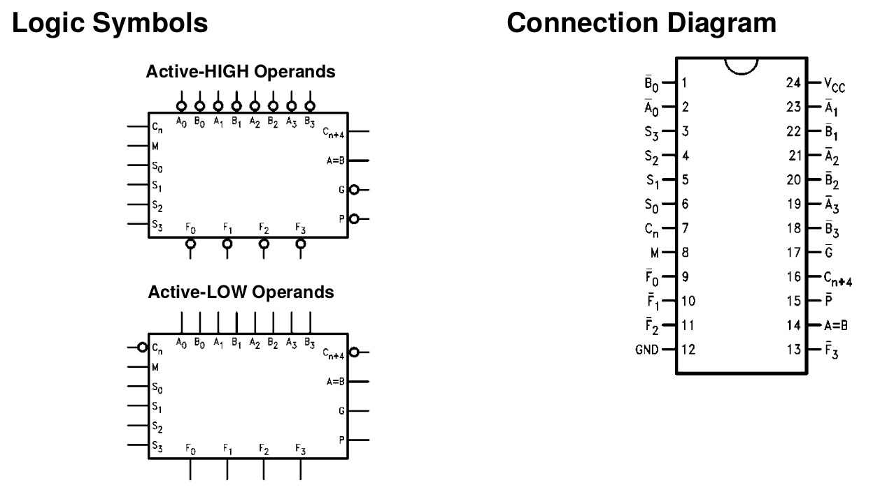
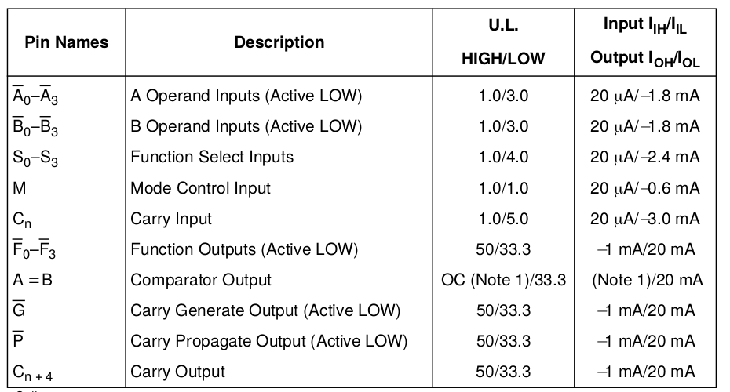
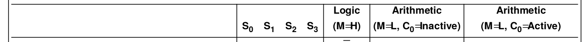
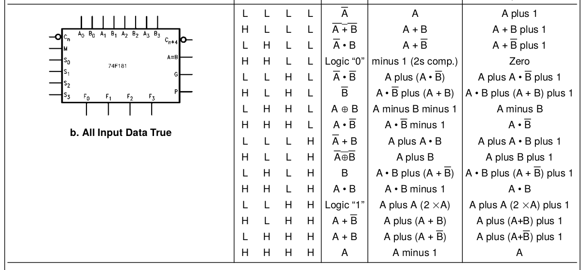
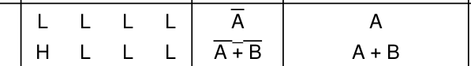
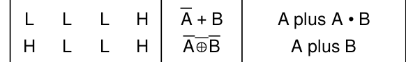
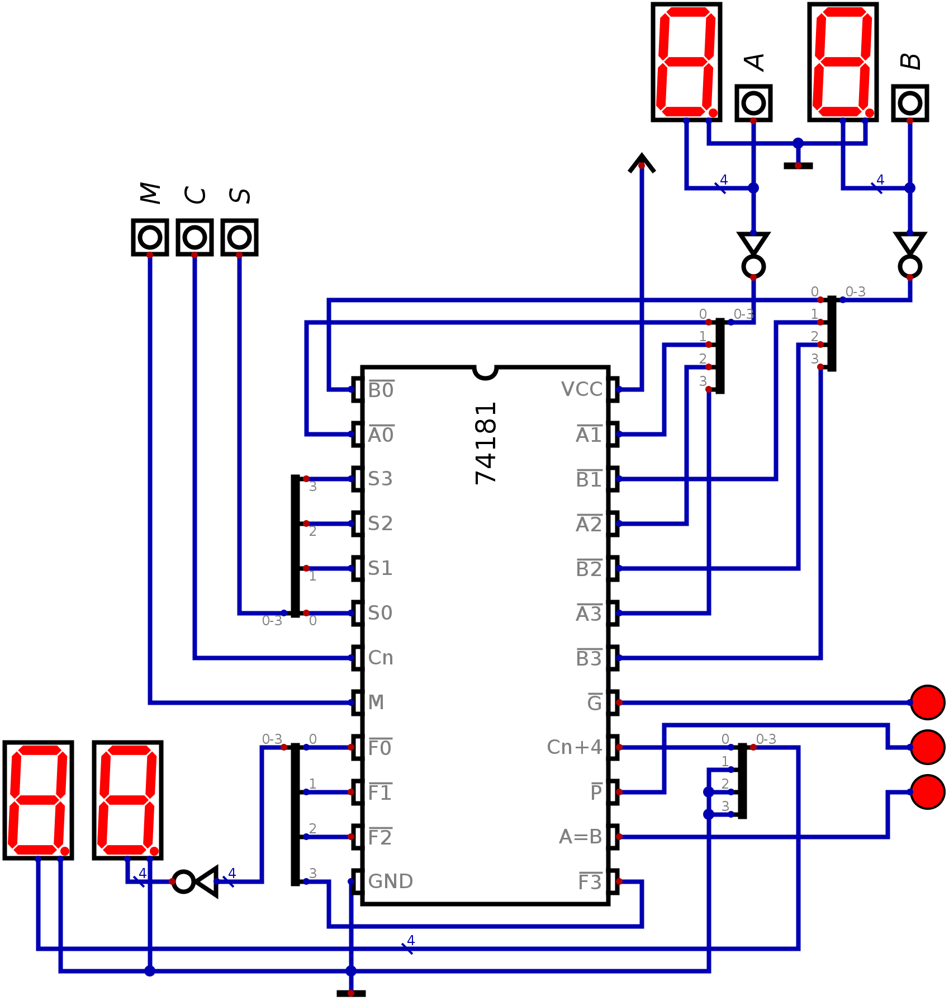

  

   
 

# PRÁTICA 07 - UNIDADE LÓGICA ARITMÉTICA

[Voltar à home](../) - [Aula Anterior](./pr06.md) - [Próxima Aula](./pr08.md)

**OBJETIVOS**

-   Realizar a montagem de uma ULA de 4 bits

**Material Necessário:**

- [Simulador de circuitos digitais *Digital*](https://github.com/marcielbp/Digital)
- 01 [TTL 74181](./pr07/datasheet/sn_74181.pdf)

Como se pode observar, à medida que a complexidade das operações
matemáticas é maior os circuitos necessários aumentam. Isso ocorre também com o aumento do número de bits envolvidos na operação. Para solucionar esses problemas foram desenvolvidos circuito integrados capazes de realizar diversas operações lógicas e aritméticas, envolvendo palavras de 4 ou 8 bits.

Esse circuito é chamado de ULA - Unidade Lógica Aritmética (em inglês ALU - Arithmetic Logic Unit). Por esse nome também
se designa o blocos interno responsável por operações lógicas e
aritméticas em processadores e microcontroladores.

Uma ULA tipicamente tem duas palavras de entrada (4 ou 8 bits) e uma palavra de saı́da (4 ou 8 bits, respectivamente). A seleção da operação a ser realizada é feita através de entradas com esses fins.
Adicionalmente, podem ser encontrados saı́das que indicam se o resultado é igual a zero, se houve estouro da capacidade de representação, comparação se os valores de entrada são iguais, qual o maior, etc.

Quando se trata de operações aritméticas, as palavras de entradas são consideradas como valores inteiros, isto é, internamente existe carry que o resultado de um bit influencie o resultado do seguinte. No caso das operações lógicas, os bits são tratados individualmente,
respeitando-se apenas a posição dos bits nas duas palavras.

O circuito [74LS181N](./pr07/datasheet/sn_74181.pdf) implementa uma ULA de 4 bits para duas entradas e uma saída. A operação e modo de funcionamento são selecionados com as
entradas S, como representado a seguir:

Observe o exemplo de configuração apresentada:

$s_3s_2s_1s_0$ = `1001` - o circuito funciona como um somador

$s_3s_2s_1s_0$ = `0001` - o circuito funciona como uma operação lógica
ou **bitwise** (aplicada em cada bit)

OBS: o [Datasheet](./pr07/datasheet/sn_74181.pdf) apresenta mais configurações de funcionamento da ULA.

## PARTE 1 - CONEXÃO DA ULA

Conecte a ULA com 4 bits em cada operando (A e B) ligadas nas chaves, e as entradas seletoras S de forma a representar as palavras `0000`, `0001`, `1000` e `1001`. Portanto, iremos implementar as funções matemáticas e lógicas a seguir: (`+` = ou lógico, `plus` = soma matemática)

Observe as ligações no arquivo de simulação [disponibilizado aqui](./pr07/dig/pr07.dig).

- Todas as entradas $A$ e $B$ são invertidas;
- O **barramento** é **multiplexado**, para diminuir a quantidade de fios;
- Carry In é representado pela entrada $C_n$;
- As saídas $F_3F_2F_1F_0$ e o bit de carry out $C(n+4)$
- O display exibe caracteres hexadecimais dispensando o circuito de driver, mas é exigida que a entrada esteja como barramento.
- $M$ e $C$ são bits únicos, enquanto $A$, $B$ e $S$ são entradas de 4 bits.

## Pós Labratório - Relatório

1- Pesquise sobre como funciona uma ULA em um processador de 4 bits (ex.: Intel 4004);

2 - Escreva uma tabela verdade para cada configuração de entrada
representada a seguir. Represente também a variável $C(4)$

|Input A  | Input B  | M=0/ S=`0000` |  M=0/ S=`0001` |  M=0/ S=`1000` |  M=0/ S=`1001` |
| - | - | - | - | - | - |
|`0101` | `1100` |  |  |  |  |
|`1111` | `0011` |  |  |  |  |  
|`1011` | `1011` |  |  |  |  |  
|`0100` | `0101` |  |  |  |  |  
|`1000` | `0111` |  |  |  |  |  
|`1010` | `0010` |  |  |  |  |  
|`1100` | `1110` |  |  |  |  |  
|`0001` | `1011` |  |  |  |  |  
|`1001` | `1111` |  |  |  |  |  
|`1011` | `0000` |  |  |  |  |  
|`0101` | `0010` |  |  |  |  |  
|`0100` | `1010` |  |  |  |  |  
|`0011` | `0010` |  |  |  |  |  
|`0010` | `1010` |  |  |  |  |  
|`1011` | `1110` |  |  |  |  |  
|`0101` | `0101` |  |  |  |  |

3 - Agora mude a configuração M para **alto** (M=1) e represente a nova tabela:

|Input A  | Input B  | M=1/ S=`0000` | M=1/ S=`0001` |  M=1/ S=`1000` |  M=1/ S=`1001` |
| - | - | - | - | - | - |
|`0101` | `1100` |  |  |  |  |  
|`1111` | `0011` |  |  |  |  |  
|`1011` | `1011` |  |  |  |  |  
|`0100` | `0101` |  |  |  |  |
|`1000` | `0111` |  |  |  |  |
|`1010` | `0010` |  |  |  |  |
|`1100` | `1110` |  |  |  |  |
|`0001` | `1011` |  |  |  |  |
|`1001` | `1111` |  |  |  |  |
|`1011` | `0000` |  |  |  |  |
|`0101` | `0010` |  |  |  |  |
|`0100` | `1010` |  |  |  |  |
|`0011` | `0010` |  |  |  |  |
|`0010` | `1010` |  |  |  |  |
|`1011` | `1110` |  |  |  |  |
|`0101` | `0101` |  |  |  |  |                            

4 - Explique para que servem as portas de saída $\overline{G}$, $\overline{P}$ e $A=B$. Em quais situações elas serão ativas?

5 - implemente uma circuito capaz de fazer operações em 8 bits utilizando duas ULAs.
