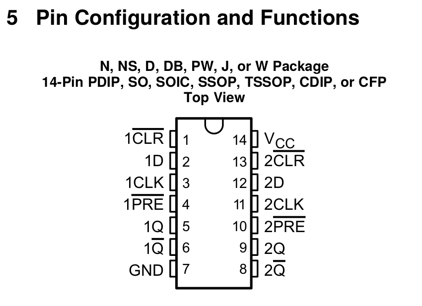
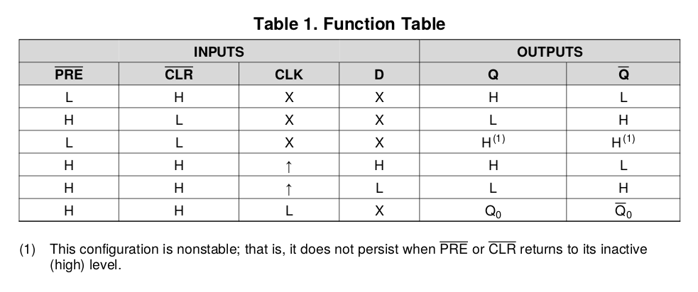
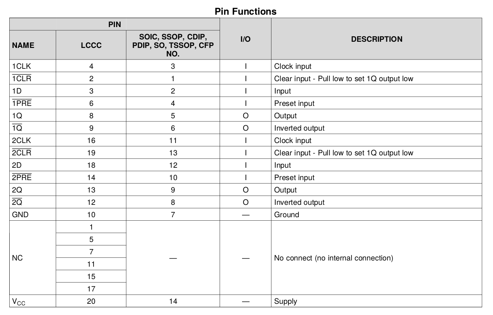
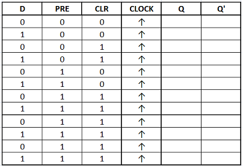
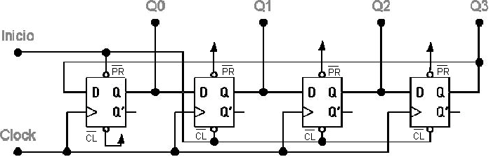
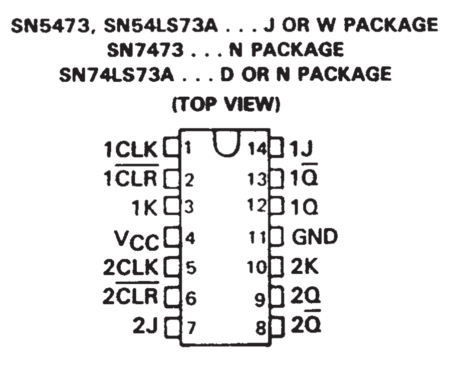
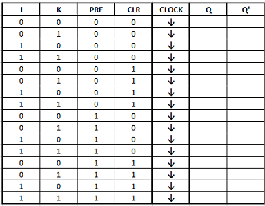

  
  
   
 

# PRÁTICA 07 - CIRCUITOS LÓGICOS SEQUENCIAIS - FLIP FLOPS D E JK

[Voltar à home](../)

**OBJETIVOS**

-   Familiarização com os circuitos digitais sequenciais;

-   Familiarização com o princípio de funcionamento dos Flip-flops;

-   Montar um contador binário utilizando os conceitos dos flip-flops;

**Material Necessário:**

• 02 TTL SN74HC74;

• 01 TTL SN74LS73N;

• Kit Digital

Os circuitos considerados até o momento eram todos circuitos
combinacionais, onde a saída é determinada pelos valores presentes nas
entradas, independente dos valores anteriores.

Os sistemas digitais são construídos usando tanto circuitos
combinacionais como dispositivos de memória (circuitos sequenciais). O
mais importante dispositivo de memória é o flip-flop, construído a
partir de combinação de portas lógicas combinacionais. Um flip-flop é um
dispositivo digital que possui duas saídas Q e Q', que estão sempre em
estados opostos.

Existem diversos tipos de flip-flops e diferentes entradas de controle
que determinam o estado da saída. O FF pode manter o estado de saída
após os sinais de entrada, que produziram o estado atual, mudarem. Desse
modo o FF pode armazenar uma informação de 1 bit. Os sistemas digitais
podem operar síncrona ou assincronamente.

Nos sistemas assíncronos, as saídas dos circuitos lógicos podem mudar de
nível lógico, sempre que o nível de uma ou mais entradas mude. Nos
sistemas síncronos, os instantes de tempo nos quais as saídas são
alteradas são determinados por um sinal chamado clock.

As entradas S, C, J, K e D dos FF síncronos, chamadas de entradas de
controle, também são denominadas de entradas síncronas, em função de seu
efeito ser sincronizado com o sinal de clock. Muitos FFs possuem
entradas assíncronas, que operam independentes das entradas síncronas e
da entrada de clock, e são usados para levar o FF a um determinado
estado passando por cima das demais entradas.

A seguir estudaremos o comportamento de todas as entradas sejam elas
síncronas ou assíncronas para os flip-flops tipo D e JK

***PARTE 1 - FLIP-FLOP TIPO D***

O circuito integrado SN74HC74 implementa **dois** flip-flops do tipo D
com clock ativo na **subida** e entradas negadas de PRESET e CLEAR,
conforme diagrama a seguir:

Implemente um flip-flop do tipo D, inserindo todas as suas entradas (D,
CLK, PRE e CLR) em chaves do kit digital. Preencha a tabela a seguir:

Agora, monte no Kit um contador anel de quatro bits e analise seu
funcionamento para comparar com o funcionamento teórico. Utilize a
entrada de Clock disponível na placa, em 1Hz, e mostre sua saída binária
nos leds e no display 7 segmentos:

***PARTE 2 - FLIP-FLOP TIPO JK***

O circuito integrado SN74LS73N implementa **dois** flip-flops do tipo JK
com clock ativo na **descida** e entradas negadas de PRESET e CLEAR
conforme diagrama a seguir:

Implemente um flip-flop JK , inserindo todas as suas entradas (D, CLK,
PRE e CLR) em chaves do kit digital. Preencha a tabela a seguir:

OBS: para manter Q~0~ nulo, dê um pulso em clear antes de iniciar a
operação.

