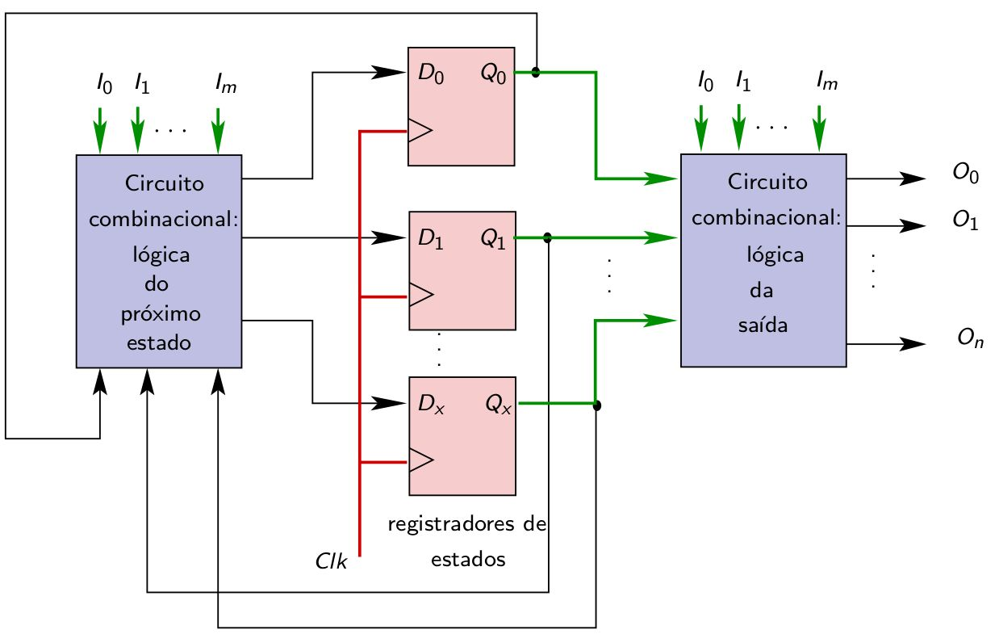
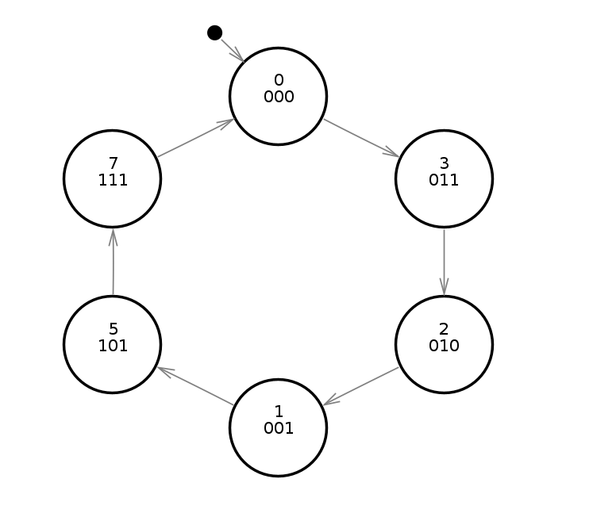
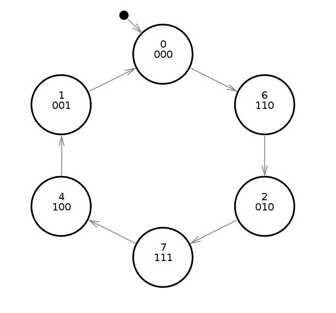

  

   
 

# PRÁTICA 09 - MÁQUINAS DE ESTADO FINITOS - Máquina de Moore

[Voltar à home](../) - [Aula Anterior](./pr07.md)

**OBJETIVOS**

-   Projeto e implementação de uma máquina de estados finitos usando flip-flops e portas lógicas

**Material Necessário:**

- 02 [TTL SN74HC74](./pr09/datasheet/SN74HC74N.pdf);
- Portas lógicas AND/OR/NOT/NAND/NOR
- [Simulador de circuitos digitais *Digital*](https://github.com/marcielbp/Digital)
- [Arquivo de Simulação](./pr08/dig/pr08.dig).

**Máquina de estados finitos** é o nome dado ao modelo genérico de circuitos sequenciais, como os contadores sı́ncronos. Nesses circuitos, a saída depende das entradas e do estado atual, que corresponde a um conjunto de variáveis binárias denominadas variáveis de estado.
Um dos modelos de MEF utilizados é o modelo de Moore, mostrado a seguir:

O procedimento genérico para a síntese de uma MEF consiste em:

-   Determinar quantos estados são necessários e selecionar um deles para estado inicial.
-   Realizar a codificação dos estados, obtendo as variáveis de estado.
-   Definir o tipo de flip-flop a ser utilizado
-   Construir o diagrama de estados escolhendo um dos modelos (Moore ou Mealy) e determinando as condições para as transições entre estados.
-   Construir a tabela do próximo estado, a tabela de excitações e a tabela das saı́das.
-   Sintetizar os circuitos combinacionais: lógica do próximo estado e saı́da.

### PARTE 1 - PRÁTICA - SÍNTESE DE UMA MEF de Moore

Abra o [arquivo de simulação](./pr08/dig/pr08.dig) com o projeto do contador utilizando máquina de estados para a sequência irregular mostrada na figura a seguir. Ao fim da contagem, o circuito volta ao estado inicial. Obtenha a tabela de excitação e de próximo estado e represente a lógica de transição de estados e da saída.
Utilize o mapa-K para determinar as expressões lógicas de $Y_2$, $Y_1$ e $Y_0$.

OBS: utilizar modelo de Moore e FFs tipo D

OBS: Lembre-se que no reset (clear), Q2, Q1 e Q0 são zerados, portanto, ligue o preset e clear juntos para iniciar a contagem.

### PARTE 2 - MODIFICAÇÃO DA MEF

Baseie-se no arquivo de simulação e no procedimento indicado na parte 1 para sintetizar uma MEF com base no diagrama de estados mostrado na figura a seguir:

