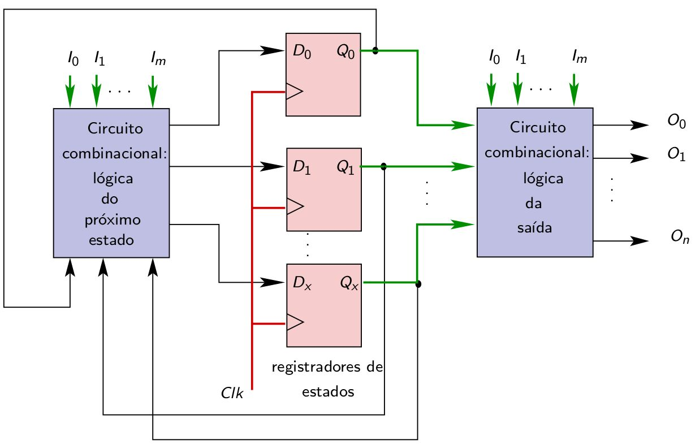
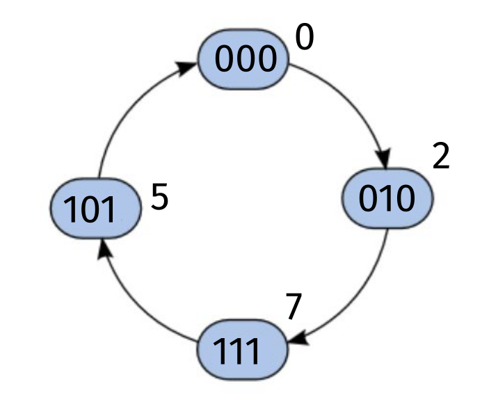
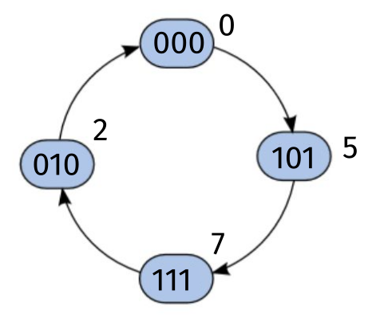
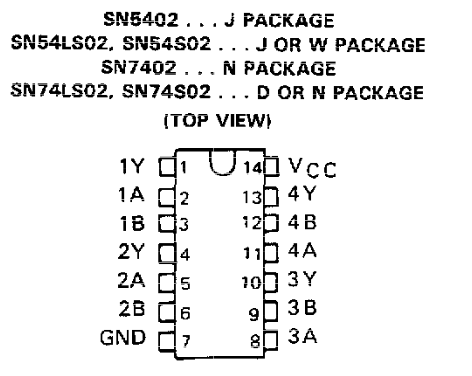
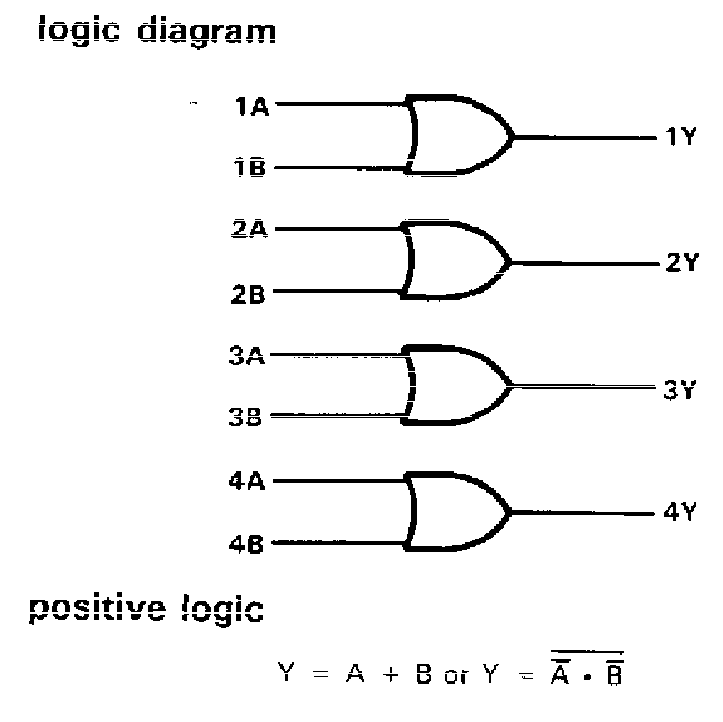

  

   
 

# PRÁTICA 09 - MÁQUINAS DE ESTADO FINITOS - Máquina de Moore

[Voltar à home](../)

**OBJETIVOS**

-   Projeto e implementação de uma máquina de estados finitos usando
    > flip-flops e portas lógicas

**Material Necessário:**

• 02 TTL SN74HC74;

• Portas lógicas AND/OR/NOT/NAND/NOR

• Kit Digital

**Máquina de estados finito**s é o nome dado ao modelo genérico de
circuitos sequenciais, como os contadores sı́ncronos. Nesses circuitos, a
saída depende das entradas e do estado atual, que corresponde a um
conjunto de variáveis binárias denominadas variáveis de estado.

Um dos modelos de MEF utilizados é o modelo de Moore, mostrado a seguir:

O procedimento genérico para a síntese de uma MEF consiste em:

-   Determinar quantos estados são necessários e selecionar um deles
    > para estado inicial.

-   Realizar a codificação dos estados, obtendo as variáveis de estado.

-   Definir o tipo de flip-flop a ser utilizado

-   Construir o diagrama de estados escolhendo um dos modelos (Moore ou
    > Mealy) e determinando as condições para as transições entre
    > estados.

-   Construir a tabela do próximo estado, a tabela de excitações e a
    > tabela das saı́das.

-   Sintetizar os circuitos combinacionais: lógica do próximo estado e
    > saı́da.

### PARTE 1 - PRÁTICA - SÍNTESE DE UMA MEF de Moore

Projete um contador utilizando máquina de estados para a seguinte
sequência irregular de quatro estados: 000, 010, 111, 101 e, em seguida,
volte ao estado inicial. Escreva a tabela de excitação e de próximo
estado e representar a lógica de transição de estados e da saída.
Utilize o mapa-K para determinar as expressões lógicas de Y2, Y1 e Y0.

OBS: utilizar modelo de Moore e FFs tipo D

OBS: Lembre-se que no reset (clear), Q2, Q1 e Q0 são zerados, portanto,
ligue o preset e clear juntos para iniciar a contagem.

  ESTADO ATUAL          PRÓXIMO ESTADO      SAÍDA
  -------------- ------ ---------------- -- -------- -------- -------- -- ---- ---- ----
  Q~2~           Q~1~   Q~0~                Q\*~2~   Q\*~1~   Q\*~0~      Y2   Y1   Y0

  *PRÓXIMO ESTADO* $Q_{0}^{} \rightarrow D_{0}$          *PRÓXIMO ESTADO* $Q_{1}^{} \rightarrow D_{1}$
  ----------------------------------------------- ------ ----------------------------------------------- ---------------------- -------------- -- ------------ ------ -------------- ---------------------- --------------
                                                  $$$$   $$$Q_{0}^{}$                                    $Q_{1}^{}$$Q_{0}^{}$   $Q_{1}^{}$$$                   $$$$   $$$Q_{0}^{}$   $Q_{1}^{}$$Q_{0}^{}$   $Q_{1}^{}$$$
  $$                                                                                                                                              $$                                                        
  $Q_{2}^{}$                                                                                                                                      $Q_{2}^{}$                                                

###

  *PRÓXIMO ESTADO* $Q_{2}^{} \rightarrow D_{2}$          *EQUAÇÕES DE SAÍDA* $Y_{2}^{}Y_{1}^{}Y_{0}^{}$
  ----------------------------------------------- ------ ------------------------------------------------ ---------------------- -------------- -- ------------ --
                                                  $$$$   $$$Q_{0}^{}$                                     $Q_{1}^{}$$Q_{0}^{}$   $Q_{1}^{}$$$      $Y_{2}^{}$   
  $$                                                                                                                                               $Y_{1}^{}$   
  $Q_{2}^{}$                                                                                                                                       $Y_{0}^{}$   

### PARTE 2 - MODIFICAÇÃO DA MEF

Modifique a MEF da parte 1 para que a contagem seja feita no sentido
contrário, conforme diagrama a seguir:

  ESTADO ATUAL          PRÓXIMO ESTADO      SAÍDA
  -------------- ------ ---------------- -- -------- -------- -------- -- ---- ---- ----
  Q~2~           Q~1~   Q~0~                Q\*~2~   Q\*~1~   Q\*~0~      Y2   Y1   Y0

  *PRÓXIMO ESTADO* $Q_{0}^{} \rightarrow D_{0}$          *PRÓXIMO ESTADO* $Q_{1}^{} \rightarrow D_{1}$
  ----------------------------------------------- ------ ----------------------------------------------- ---------------------- -------------- -- ------------ ------ -------------- ---------------------- --------------
                                                  $$$$   $$$Q_{0}^{}$                                    $Q_{1}^{}$$Q_{0}^{}$   $Q_{1}^{}$$$                   $$$$   $$$Q_{0}^{}$   $Q_{1}^{}$$Q_{0}^{}$   $Q_{1}^{}$$$
  $$                                                                                                                                              $$                                                        
  $Q_{2}^{}$                                                                                                                                      $Q_{2}^{}$                                                

###

  *PRÓXIMO ESTADO* $Q_{2}^{} \rightarrow D_{2}$          *EQUAÇÕES DE SAÍDA* $Y_{2}^{}Y_{1}^{}Y_{0}^{}$
  ----------------------------------------------- ------ ------------------------------------------------ ---------------------- -------------- -- ------------ --
                                                  $$$$   $$$Q_{0}^{}$                                     $Q_{1}^{}$$Q_{0}^{}$   $Q_{1}^{}$$$      $Y_{2}^{}$   
  $$                                                                                                                                               $Y_{1}^{}$   
  $Q_{2}^{}$                                                                                                                                       $Y_{0}^{}$   

***DATASHEET 74HC74 FLIP-FLOP TIPO D***

CIs Lógicos: **74HC04 (6-NOT), 74HC08 (4-AND), 74HC32 (4-OR)**

  **7400 - NAND**    

  ------------------ ----------------------------------------------------------------------------------------------------------------------------------------------------------------------------------
  **7402 - NOR**     

  **74HC04 - NOT**   

  **74HC08 - AND**   

  **74HC32**         

